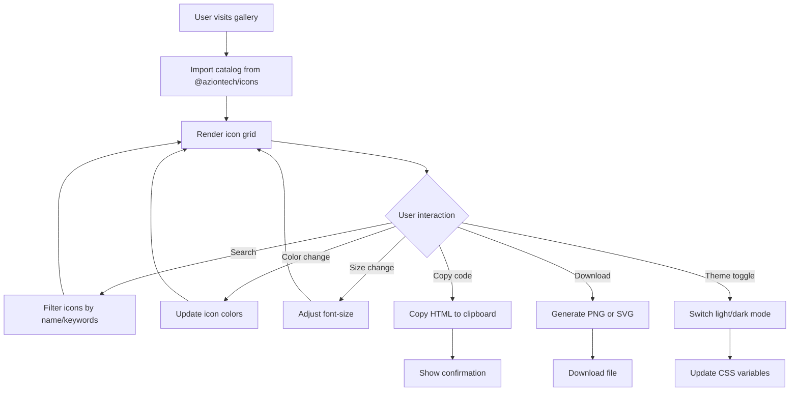
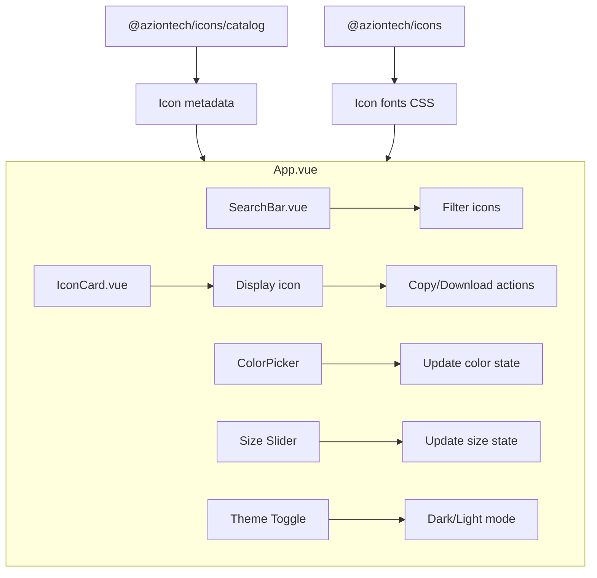
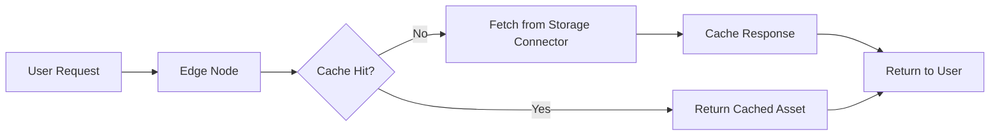

# Icons Gallery

> Visual showcase and documentation for **@aziontech/icons** — Azion's icon font library featuring azionicons (`ai`) and primeicons (`pi`).

[](LICENSE)
[](https://vuejs.org/)
[](https://vitejs.dev/)

---

## Overview

The Icons Gallery is a Vue 3 single-page application that provides an interactive visual reference for all icons available in the `@aziontech/icons` package. It allows developers to:

- **Search** icons by name or keywords
- **Preview** icons at different sizes (8px–320px)
- **Customize** icon colors using a color picker
- **Copy** icon HTML code to clipboard
- **Download** icons as PNG or SVG files
- **Toggle** between light and dark themes

The application is deployed on **Azion's Edge Platform** for low-latency global delivery.

---

## Architecture

### Technology Stack

| Layer            | Technology                                | Purpose                                    |
| ---------------- | ----------------------------------------- | ------------------------------------------ |
| **Framework**    | Vue 3 (Composition API, `<script setup>`) | Reactive UI components                     |
| **Build**        | Vite                                      | Dev server, bundling, preview              |
| **Styling**      | Tailwind CSS                              | Utility-first CSS framework                |
| **Icons**        | `@aziontech/icons`                        | Icon font + catalog (workspace dependency) |
| **Color Picker** | `vue3-colorpicker`                        | Color selection widget                     |
| **Testing**      | Vitest + jsdom                            | Unit testing                               |
| **Deployment**   | Azion Edge Platform                       | Global edge deployment                     |

### Application Flow



### Component Architecture



---

## Project Structure

```
apps/icons-gallery/
├── public/
│   └── favicon.ico          # Site favicon
├── src/
│   ├── components/
│   │   ├── IconCard.vue     # Individual icon display card
│   │   └── SearchBar.vue    # Search input with filtering
│   ├── App.vue              # Main application component
│   ├── main.css             # Global styles and Tailwind imports
│   ├── main.js              # Application entry point
│   └── theme.js             # Dark/light theme management
├── tests/
│   └── unit/
│       ├── __mocks__/
│       ├── iconDownload.spec.js  # Download functionality tests
│       └── jest.setup.js         # Vitest setup file (legacy filename)
├── azion/
│   ├── args.json            # Build arguments for Azion CLI
│   └── azion.json           # Edge application manifest
├── azion.config.cjs         # Azion project configuration
├── index.html               # Vite HTML entry point
├── jsconfig.json            # JavaScript/IDE configuration
├── package.json             # Dependencies and scripts
├── postcss.config.js        # PostCSS configuration
├── tailwind.config.js       # Tailwind CSS configuration
├── vite.config.js           # Vite dev/build configuration
└── vitest.config.js         # Vitest test configuration
```

### Key Files Explained

| File                                                           | Purpose                                                                      |
| -------------------------------------------------------------- | ---------------------------------------------------------------------------- |
| [`src/App.vue`](src/App.vue)                                   | Main component containing icon grid, controls, and state management          |
| [`src/components/IconCard.vue`](src/components/IconCard.vue)   | Renders individual icon with hover actions (copy code, copy image, download) |
| [`src/components/SearchBar.vue`](src/components/SearchBar.vue) | Search input with real-time filtering                                        |
| [`src/theme.js`](src/theme.js)                                 | Theme initialization and toggle functionality                                |
| [`vite.config.js`](vite.config.js)                             | Vite dev server (port 3333) and build config                                 |
| [`vitest.config.js`](vitest.config.js)                         | Vitest config (jsdom environment, setup file)                                |
| [`azion.config.cjs`](azion.config.cjs)                         | Edge deployment configuration with caching rules                             |

Icon metadata is **not** stored locally — it is imported at runtime from `@aziontech/icons/catalog` (resolved to `packages/icons/dist/catalog.json`).

---

## Getting Started

### Prerequisites

- Node.js 18+
- pnpm (workspace package manager)

### Installation

This app is part of a pnpm monorepo. From the workspace root:

```bash
# Install all workspace dependencies
pnpm install
```

### Development Server

```bash
# From the app directory
pnpm serve

# Or from workspace root
pnpm --filter icons-gallery serve
```

The app will be available at `http://localhost:3333` with HMR enabled (configured in `vite.config.js`).

### Build for Production

```bash
# Standard Vite build → ./dist
pnpm build

# Build optimized for Azion Edge Platform
pnpm build:azion
```

---

## Available Scripts

| Script                 | Description                                                    |
| ---------------------- | -------------------------------------------------------------- |
| `pnpm serve`           | Start Vite dev server with HMR on port 3333                    |
| `pnpm build`           | Build production bundle via Vite                               |
| `pnpm build:azion`     | Build optimized for Azion Edge Platform                        |
| `pnpm preview`         | Preview production build with Vite                             |
| `pnpm test:unit`       | Run Vitest unit tests once                                     |
| `pnpm test:unit:watch` | Run Vitest in watch mode                                       |
| `pnpm lint`            | Run ESLint with autofix                                        |
| `pnpm format`          | Format `src/` with Prettier                                    |
| `pnpm publish`         | Deploy to Azion Edge Platform (`azion deploy --local --debug`) |

---

## Configuration

### Vite (`vite.config.js`)

```javascript
import vue from '@vitejs/plugin-vue'
import { fileURLToPath, URL } from 'node:url'
import { defineConfig } from 'vite'

export default defineConfig({
  plugins: [vue()],
  resolve: {
    alias: { '@': fileURLToPath(new URL('./src', import.meta.url)) }
  },
  server: { port: 3333, open: true }
})
```

### Vitest (`vitest.config.js`)

```javascript
import { defineConfig } from 'vitest/config'
import vue from '@vitejs/plugin-vue'

export default defineConfig({
  plugins: [vue()],
  test: {
    environment: 'jsdom',
    setupFiles: ['./tests/unit/jest.setup.js'],
    include: ['tests/unit/**/*.{test,spec}.{js,mjs,cjs,ts,mts,cts,jsx,tsx}'],
    globals: true
  }
})
```

### Tailwind CSS (`tailwind.config.js`)

```javascript
module.exports = {
  content: ['./index.html', './src/**/*.{vue,js,ts}']
  // Theme extensions defined inline.
}
```

### Azion Edge (`azion.config.cjs`)

Configures edge deployment with:

- **Storage connector** for static assets
- **Cache policies** (2-hour browser/edge TTL)
- **SPA routing** via rewrite to `index.html`
- **Static asset delivery** directly from edge storage

---

## Icon Showcase

The gallery displays icons from two font families. Counts below match the current `@aziontech/icons/catalog` snapshot:

### Azionicons (`ai`) — 88 icons

Azion-specific product and platform icons organized by category:

#### Platform Pillars

| Icon           | Class                  | Usage               |
| -------------- | ---------------------- | ------------------- |
| AI Pillar      | `ai ai-ai-pillar`      | AI/ML capabilities  |
| Build Pillar   | `ai ai-build-pillar`   | Build processes     |
| Deploy Pillar  | `ai ai-deploy-pillar`  | Deployment services |
| Secure Pillar  | `ai ai-secure-pillar`  | Security features   |
| Observe Pillar | `ai ai-observe-pillar` | Observability tools |

#### Edge Products

| Icon              | Class                     | Usage                    |
| ----------------- | ------------------------- | ------------------------ |
| Edge Application  | `ai ai-edge-application`  | Edge applications        |
| Edge Functions    | `ai ai-edge-functions`    | Serverless functions     |
| Edge Firewall     | `ai ai-edge-firewall`     | Web application firewall |
| Edge DNS          | `ai ai-edge-dns`          | DNS services             |
| Edge KV           | `ai ai-edge-kv`           | Key-value storage        |
| Edge SQL          | `ai ai-edge-sql`          | SQL database             |
| Edge Storage      | `ai ai-edge-storage`      | Object storage           |
| Edge Orchestrator | `ai ai-edge-orchestrator` | Workflow orchestration   |

#### Framework Integrations

| Icon    | Class           | Usage             |
| ------- | --------------- | ----------------- |
| Angular | `ai ai-angular` | Angular framework |
| React   | `ai ai-react`   | React framework   |
| Vue     | `ai ai-vue`     | Vue framework     |
| Next.js | `ai ai-next`    | Next.js framework |
| Nuxt    | `ai ai-nuxt`    | Nuxt framework    |
| Astro   | `ai ai-astro`   | Astro framework   |
| Vite    | `ai ai-vite`    | Vite build tool   |

#### Tools & Services

| Icon        | Class               | Usage                |
| ----------- | ------------------- | -------------------- |
| Azion CLI   | `ai ai-azion-cli`   | Command-line tool    |
| Azion API   | `ai ai-azion-api`   | API services         |
| Ask Azion   | `ai ai-ask-azion`   | AI assistant         |
| Marketplace | `ai ai-marketplace` | Marketplace services |

### PrimeIcons (`pi`) — 314 icons

General-purpose UI icons from the PrimeIcons library. Some commonly used icons:

#### Navigation & Arrows

| Icon        | Class               | Usage           |
| ----------- | ------------------- | --------------- |
| Home        | `pi pi-home`        | Home navigation |
| Arrow Right | `pi pi-arrow-right` | Right direction |
| Arrow Left  | `pi pi-arrow-left`  | Left direction  |
| Arrow Up    | `pi pi-arrow-up`    | Up direction    |
| Arrow Down  | `pi pi-arrow-down`  | Down direction  |
| Angle Right | `pi pi-angle-right` | Chevron right   |
| Angle Left  | `pi pi-angle-left`  | Chevron left    |

#### Actions

| Icon     | Class            | Usage           |
| -------- | ---------------- | --------------- |
| Search   | `pi pi-search`   | Search action   |
| Plus     | `pi pi-plus`     | Add/create      |
| Times    | `pi pi-times`    | Close/cancel    |
| Check    | `pi pi-check`    | Confirm/success |
| Edit     | `pi pi-pencil`   | Edit action     |
| Delete   | `pi pi-trash`    | Delete action   |
| Download | `pi pi-download` | Download action |
| Copy     | `pi pi-copy`     | Copy action     |
| Cog      | `pi pi-cog`      | Settings        |

#### Status & Feedback

| Icon                 | Class                        | Usage             |
| -------------------- | ---------------------------- | ----------------- |
| Info Circle          | `pi pi-info-circle`          | Information       |
| Exclamation Triangle | `pi pi-exclamation-triangle` | Warning           |
| Ban                  | `pi pi-ban`                  | Forbidden/blocked |
| Bell                 | `pi pi-bell`                 | Notifications     |
| Spinner              | `pi pi-spinner`              | Loading state     |

---

## Adding New Icons

The gallery has no local icon list — it consumes the catalog generated by `@aziontech/icons`. To make new icons show up:

1. Add the icon to `packages/icons` (SVG sources + catalog entry as the package's build expects).
2. Rebuild the icons package:
   ```bash
   pnpm --filter @aziontech/icons build
   ```
3. Restart the gallery dev server (`pnpm serve`) — the new icon appears automatically once `packages/icons/dist/catalog.json` is regenerated.

---

## Deployment

### Azion Edge Platform

```bash
# Build for edge deployment
pnpm build:azion

# Deploy (requires Azion CLI authentication)
pnpm publish
```

> The `publish` script in this app does **not** publish to npm — it calls `azion deploy --local --debug`. The name is preserved for legacy automation reasons.

#### Deployment Architecture



The deployment configuration includes:

- **Storage Connector**: Serves static assets from edge storage
- **Cache Policy**: 2-hour TTL for browser and edge cache
- **SPA Routing**: All routes rewrite to `index.html` for client-side routing

---

## Testing

```bash
# Run all unit tests once
pnpm test:unit

# Watch mode
pnpm test:unit:watch
```

Tests live in `tests/unit/` and run on **Vitest** with the **jsdom** environment. The setup file is `tests/unit/jest.setup.js` (filename kept for git-history continuity after the Jest → Vitest migration).

### Current Coverage

| Module        | Tests                                             |
| ------------- | ------------------------------------------------- |
| Icon Download | PNG/SVG download helpers (`iconDownload.spec.js`) |

---

## Contributing

### Development Workflow

1. **Create a feature branch** from `main`
2. **Make changes** following the existing code style
3. **Run linting and formatting**:
   ```bash
   pnpm lint
   pnpm format
   ```
4. **Run tests**:
   ```bash
   pnpm test:unit
   ```
5. **Submit a pull request** with a clear description

### Code Style

- Vue 3 Composition API with `<script setup>`
- Tailwind CSS utility classes for styling
- ESLint + Prettier for code formatting

---

## Related Packages

| Package                                              | Description                                 |
| ---------------------------------------------------- | ------------------------------------------- |
| [`@aziontech/icons`](../../packages/icons/README.md) | Icon font library (azionicons + primeicons) |

---

## License

[MIT](LICENSE) © 2026 Azion Technologies
