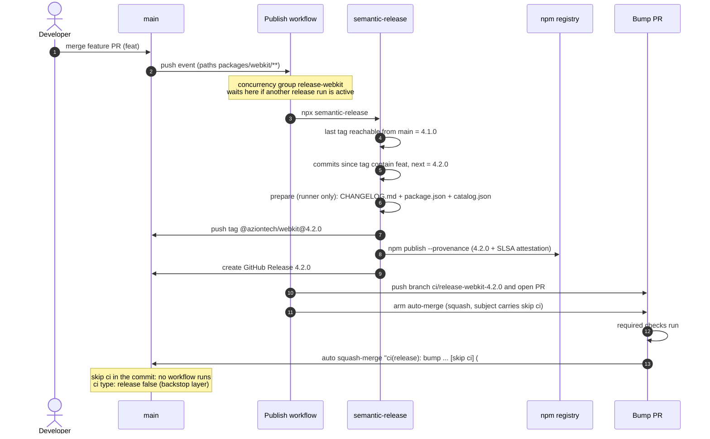
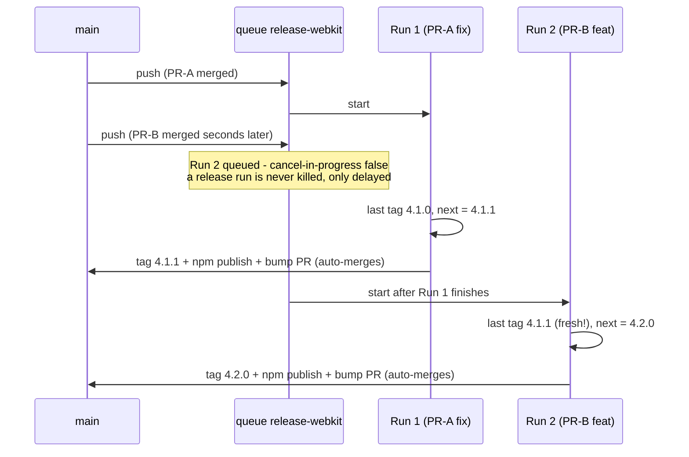
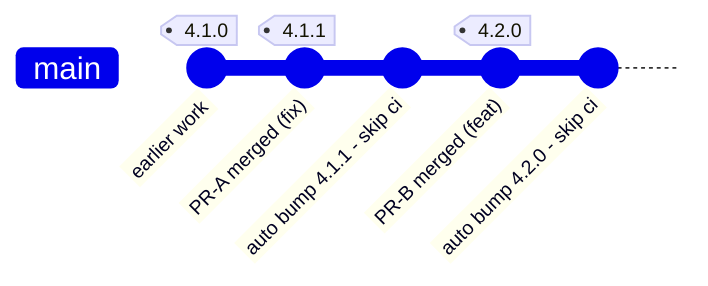

# Merge → Release → Bump — Visual Flow

The full lifecycle of a merge to `main` with the current pipeline (post #787 + #795):
release published by CI, bump PR opened and **auto-merged** — zero human steps after
the feature merge. Complements `SEMANTIC_RELEASE_FLOW.md` (version math, conflict and
race cases). Diagrams render on GitHub, VS Code (Mermaid extension) or https://mermaid.live.

---

## 1. One merge, end to end (example: webkit at 4.1.0, a `feat:` PR merges)

Key points:

- Steps 1–2 are the **only human action**. Everything after is CI.
- The **release exists at step 9–10** (npm + GitHub Release) — the bump PR (steps 11–14)
  is bookkeeping that follows; npm never waits for it.
- The tag lands on the **feature merge commit**; the bump commit gets no tag and
  triggers nothing.

---

## 2. Two PRs merged seconds apart — the concurrency queue

Without the queue both runs would read `4.1.0`, compute `4.1.1` and `4.2.0` in
parallel, and whichever published the **lower** version **second** would be rejected
by npm. With the queue each run starts from the tag the previous one just pushed —
two clean releases, in order, always.

---

## 3. What main looks like after both cycles

Reading it:

| Commit | Created by | Tagged? | Triggers a workflow? |
| --- | --- | --- | --- |
| feature merge | human merging the PR | yes — the release tag | yes — the release run |
| auto bump | CI (auto-merged bump PR) | no | no (`skip ci` + `ci:` type) |

The repeating pattern on `main` is always: *feature commit (tagged) → bump commit
(silent)* — one pair per release, no human in the loop after the feature merge.
