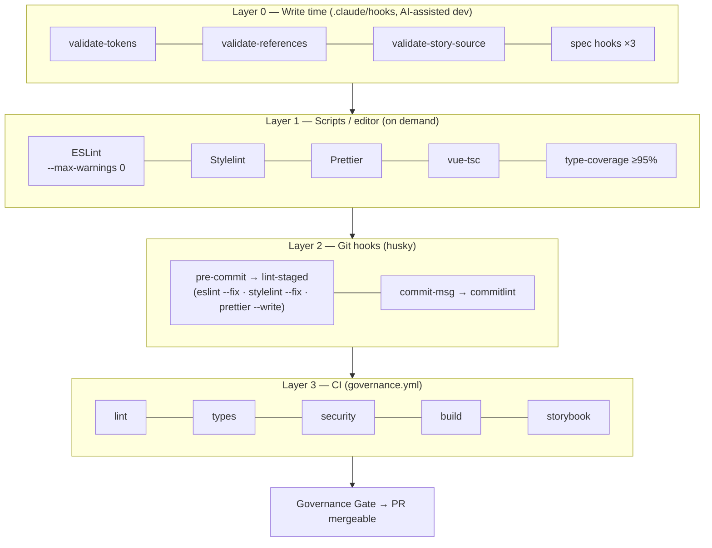
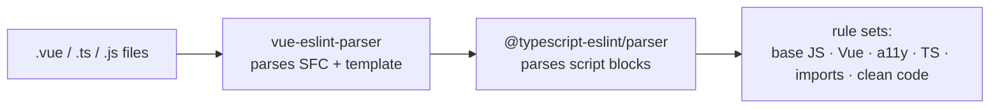
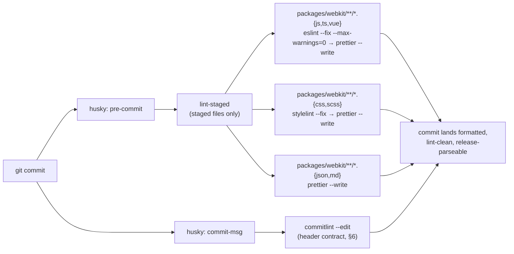
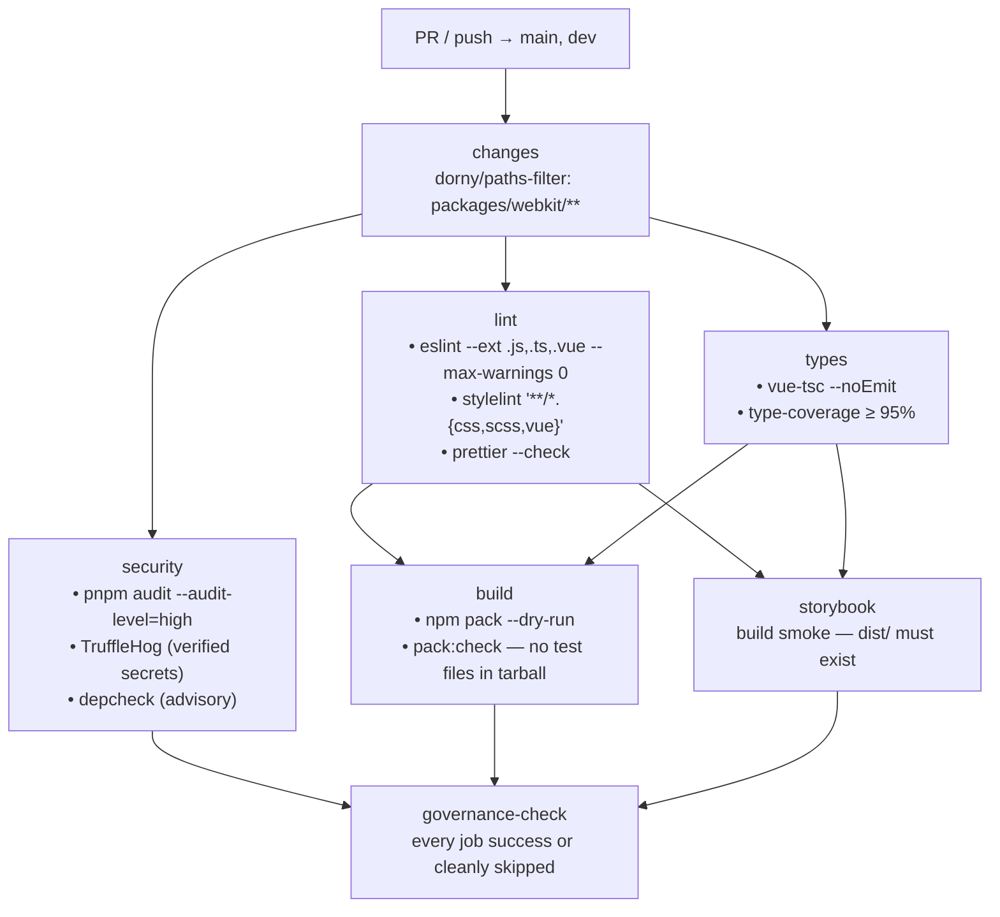

# Lint & Static Quality — Overview

> **@aziontech/webkit monorepo** · snapshot of July 2026
> Companion doc: [`OVERVIEW_TESTS.md`](./OVERVIEW_TESTS.md) (runtime test layers)

## TL;DR

Code quality is enforced in **four layers of defense**, from the moment code is written to the moment a PR merges. The same tools run at every layer — what changes is *when* they fire and *how much* they check:

| Layer | When | What runs |
|---|---|---|
| **0 — Write time** | as files are written (AI-assisted dev) | 7 Claude Code guardrail hooks (tokens, imports, specs, story shape, test existence) |
| **1 — Scripts / editor** | on demand | ESLint (zero warnings) · Stylelint · Prettier · `vue-tsc` · type-coverage ≥95% |
| **2 — Git hooks** | `git commit` | husky → lint-staged (auto-fix staged files) + commitlint (message contract) |
| **3 — CI** | PR / push to `main`, `dev` | `governance.yml`: lint + types + security + build + Storybook smoke, behind one gate |

Philosophy: **ESLint owns correctness, Prettier owns formatting, Stylelint owns CSS, vue-tsc owns types, commitlint owns release semantics** — no tool overlaps another's job, and warnings don't exist (`--max-warnings 0`: an issue is either an error or not a rule).

---

## 1. The four layers



Each layer catches what the previous one missed: hooks stop AI-generated drift at the source, lint-staged guarantees no unformatted commit ever lands, and CI re-runs everything from a clean checkout so "works on my machine" can't merge.

---

## 2. ESLint — correctness linting

**Config:** single **flat config** (ESLint 9) at the repo root, [`eslint.config.js`](../eslint.config.js). `packages/webkit/eslint.config.js` just re-exports it — one ruleset, no per-package drift.

### 2.1 Parser chain

Vue SFCs need two parsers stacked — one for the template, one for the script:



### 2.2 The plugins, and what each one is for

| Plugin | Job |
|---|---|
| `@eslint/js` (recommended) | the ESLint core baseline — syntax errors, unreachable code, `no-undef`, etc. |
| `eslint-plugin-vue` | Vue 3 SFC correctness: template mistakes, props/emits contracts, computed purity |
| `@typescript-eslint` | TypeScript-aware rules replacing the JS equivalents (`no-unused-vars`, `no-explicit-any`) |
| `eslint-plugin-vuejs-accessibility` | WCAG checks inside Vue templates (the static complement to axe-core in the test suite) |
| `eslint-plugin-import` | import hygiene — position, duplicates; resolves paths through `tsconfig.json` |
| `eslint-plugin-simple-import-sort` | deterministic, auto-fixable import/export ordering — kills "import shuffle" diff noise |
| `eslint-plugin-unused-imports` | registered in the config, **no rule currently enabled** (see §10 Observations) |

### 2.3 The rules that shape the codebase

**Vue — API and template discipline**

| Rule | Effect |
|---|---|
| `vue/component-definition-name-casing: PascalCase` · `vue/component-name-in-template-casing: PascalCase` | one naming convention on both sides — matches the repo-wide "one name, everywhere" rule (`<Skeleton>`, never `<skeleton>`) |
| `vue/component-tags-order: script[setup] → template → style` | every SFC reads in the same order |
| `vue/require-default-prop` | every optional prop declares its default — the spec's Props table made executable |
| `vue/require-explicit-emits` | no undeclared events; the emit surface is always visible in the component's contract |
| `vue/no-mutating-props` (`shallowOnly: false`) | props are read-only all the way down — state flows via `v-model` / events |
| `vue/no-v-html` | security: no raw HTML injection path |
| `vue/no-side-effects-in-computed-properties` · `vue/no-async-in-computed-properties` · `vue/no-arrow-functions-in-watch` · `vue/no-ref-as-operand` | reactivity correctness — computed stays pure, refs are used as refs |
| `vue/no-dupe-keys` · `no-dupe-v-else-if` · `no-duplicate-attributes` · `no-child-content` · `v-if-else-key` · `no-reserved-props` (Vue 3) · `no-export-in-script-setup` · `no-empty-component-block` · `no-unused-vars` | template/SFC bug class eliminated at lint time |
| `vue/multi-word-component-names: off` | deliberate: the design system has single-word components (`Button`, `Table`, `Chip`) |

**Accessibility (static)**

| Rule | Effect |
|---|---|
| `vuejs-accessibility/alt-text` | images must carry alternative text |
| `vuejs-accessibility/aria-props` / `aria-role` | only valid ARIA attributes and roles |
| `vuejs-accessibility/click-events-have-key-events` | anything clickable is keyboard-operable |

These run at write time on the template; the runtime counterpart (axe-core on the rendered tree) lives in the test suite — two passes over the same concern.

**TypeScript**

| Rule | Effect |
|---|---|
| `@typescript-eslint/no-explicit-any` | `any` is an error — pairs with the 95% type-coverage gate (§5) |
| `@typescript-eslint/no-unused-vars` (`argsIgnorePattern: '^_'`) | dead code flagged; intentional unused args spelled `_arg` (core `no-unused-vars` is off in favor of this TS-aware version) |

**Imports & clean code**

| Rule | Effect |
|---|---|
| `simple-import-sort/imports` + `/exports` | canonical, auto-fixable ordering |
| `import/first` · `import/newline-after-import` · `import/no-duplicates` | imports at the top, one blank line after, one statement per module |
| `no-console` (`allow: warn, error`) | no stray `console.log` in library code |
| `no-debugger` · `prefer-const` | no leftover debug stops; immutability by default |

### 2.4 Zero-warnings policy

Every ESLint invocation — script, lint-staged, CI — runs with **`--max-warnings 0`**. There is no "warning debt" category: a rule either blocks or doesn't exist.

---

## 3. Prettier — formatting

**Config:** [`.prettierrc.json`](../.prettierrc.json). Formatting is Prettier's job alone — ESLint has no stylistic rules to fight it, so no `eslint-config-prettier` shim is wired into the flat config.

| Option | Value | Meaning |
|---|---|---|
| `semi` | `false` | no semicolons |
| `singleQuote` | `true` | `'single'` quotes |
| `tabWidth` | `2` | 2-space indent |
| `printWidth` | `100` | wrap at 100 columns |
| `trailingComma` | `"none"` | no trailing commas |
| `singleAttributePerLine` | `true` | one attribute per line in templates — long `data-[kind=…]` class/attribute stacks stay readable and diff line-by-line |
| `vueIndentScriptAndStyle` | `true` | `<script>`/`<style>` content indented inside SFC blocks |

`packages/webkit/.prettierignore` skips generated output: `dist`, `*.min.css`, `*.d.ts`, `coverage`, `storybook-static`, `node_modules`.

---

## 4. Stylelint — CSS/SCSS linting

**Config:** [`.stylelintrc.json`](../.stylelintrc.json), scanning `packages/webkit/**/*.{css,scss,vue}`.

Context: the styling rule forbids `<style>` blocks and component-local CSS inside webkit components — so Stylelint is the **backstop** for the few legitimate stylesheets (e.g. `styles/country-flags.css`, legacy components) and any `<style>` block that would sneak in.

| Piece | Value | Meaning |
|---|---|---|
| Extends | `stylelint-config-standard-scss` + `stylelint-config-recommended-vue` | standard CSS/SCSS baseline + `.vue` SFC awareness |
| Plugin | `stylelint-order` | property ordering |
| `order/properties-alphabetical-order` | on | properties always alphabetical — declaration diffs stay minimal |
| `selector-class-pattern` | `^[a-z][a-z0-9]*(-[a-z0-9]+)*$` | class names are kebab-case, matching component naming |
| `selector-max-id` | `0` | no `#id` selectors — specificity stays flat |
| `declaration-block-no-duplicate-properties` · `no-duplicate-selectors` | on | duplicate declarations/selectors are bugs |
| `property-no-vendor-prefix` / `value-no-vendor-prefix` | warn | prefixes belong to autoprefixer, not hand-written CSS |
| `no-descending-specificity` | warn | specificity ordering surfaced without blocking legacy CSS |
| `at-rule-no-unknown` | disabled | tolerates Tailwind's at-rules (`@tailwind`, `@apply`, …) |

---

## 5. Type checking — `vue-tsc` + type-coverage

Two complementary gates:

1. **`vue-tsc --noEmit`** (`pnpm webkit:type-check`) — full TypeScript program check across `.ts` **and** `.vue` files. Backed by a strict base config (`tsconfig.base.json`):

   | Flag | Effect |
   |---|---|
   | `strict: true` | the whole strict family (null checks, implicit any, …) |
   | `noUnusedLocals` / `noUnusedParameters` | dead code is a type error |
   | `noImplicitReturns` / `noImplicitOverride` | every code path returns; overrides are explicit |
   | `moduleResolution: bundler` | resolution matches Vite's |

   `packages/webkit/tsconfig.json` adds `noPropertyAccessFromIndexSignature` and declaration emit (`declaration` + `emitDeclarationOnly`) — the same compiler that gates PRs also generates the published `.d.ts` at release time. Tests, `.figma.ts`, and `src/test/` are excluded from emit.

2. **`type-coverage -p . --at-least 95`** (`pnpm webkit:type-coverage`) — measures how many expressions have a real (non-`any`) type and **fails below 95%**. This closes the gap `no-explicit-any` can't see: *implicit* `any` leaking through inference.

---

## 6. commitlint — the commit message contract

**Config:** [`commitlint.config.js`](../commitlint.config.js), run by husky on every `commit-msg`.

Commits aren't just style here — they **drive releases**. `semantic-release` reads the same header format to compute version bumps, so commitlint's job is making sure a commit that passes locally also releases correctly.

**Header shape** (custom `headerPattern`, mirrored in every `packages/*/.releaserc`):

```
[ENG-1231] feat(webkit): add table export     ← optional ticket prefix
fix(webkit): correct paginator focus ring
chore: bump tooling
feat(webkit)!: drop tone prop                 ← “!” = breaking = major
```

**Types and the release each produces:**

| Type | Release bump |
|---|---|
| `feat` | **minor** |
| `fix` · `hotfix` · `chore` · `docs` · `style` · `refactor` · `perf` | **patch** |
| `test` · `ci` · `revert` | **none** (allowed for hygiene) |
| any type with `!` or a `BREAKING CHANGE:` footer | **major** |

**Other rules:** type required and lower-case, scope lower-case, subject required, header ≤ 100 chars, subject-case unrestricted.

**The sync invariant** ([`release-types.md`](../.claude/rules/release-types.md)): this type list must stay **identical** in four places — `commitlint.config.js`, every `packages/*/.releaserc` (`webkit`, `theme`, `icons`), `CONTRIBUTING.md`, and the `/open-pr` + `/create-branch` flows. A type added in one place and not the others produces commits that pass lint but silently don't release.

---

## 7. Git hooks — husky + lint-staged



- `.husky/pre-commit` → `pnpm lint-staged`; `.husky/commit-msg` → `pnpm exec commitlint --edit "$1"` (config lives in the root `package.json` → `lint-staged`).
- Only **staged** files are processed, and fixers run first (`--fix`, `--write`) — the hook heals what it can and blocks only on what it can't.
- Scope is `packages/webkit/**` — the published library is what pre-commit protects.
- Never bypassed: the git-workflow rule forbids `--no-verify`.

---

## 8. CI — the governance pipeline

**Workflow:** [`.github/workflows/governance.yml`](../.github/workflows/governance.yml) · PRs and pushes to `main` and `dev` · path-filtered to `packages/webkit/**` (jobs short-circuit as "skipped" when nothing relevant changed, so required checks stay green).



What each job contributes:

| Job | Checks | Why it's here |
|---|---|---|
| **lint** | ESLint (0 warnings) · Stylelint · `prettier --check` | re-runs Layer 1/2 from a clean checkout — local bypasses can't merge |
| **types** | `vue-tsc` · type-coverage ≥95% | the type gates of §5, enforced on every PR |
| **security** | `pnpm audit` (high+) · TruffleHog verified-secret scan · `depcheck` (continue-on-error) | vulnerable deps and committed secrets block; unused deps are advisory |
| **build** | `pack:dry` + `pack:check` | publish safety — the npm tarball is valid and ships zero test files |
| **storybook** | full `storybook:build` | the docs app compiling is a smoke test over every story and component |
| **governance-check** | aggregates all of the above | the **single required status** for branch protection |

The functional and visual test workflows (`package-webkit-test.yml`, `app-storybook-visual.yml`) run alongside governance — see [`OVERVIEW_TESTS.md`](./OVERVIEW_TESTS.md).

---

## 9. Layer 0 — AI guardrail hooks (`.claude/hooks/`)

A layer conventional linters don't have: this repo is developed AI-assisted, and **Claude Code hooks lint the writes themselves** — every `Write`/`Edit` to the repo is intercepted and validated *before or right after it lands*, enforcing the design-system rules that ESLint can't express. They only flag **newly introduced** violations (legacy components are whitelisted), so the codebase migrates as it's touched.

| Hook | Fires | Blocks |
|---|---|---|
| `validate-tokens.mjs` | Pre-write | hardcoded hex colors, raw Tailwind palette, raw typography — anything outside the DESIGN.md token catalog; also `any` and `@ts-ignore` |
| `validate-references.mjs` | Pre-write | phantom imports: any `@aziontech/webkit/*` path missing from the exports map, unresolvable relative imports, uninstalled packages (kills import hallucination) |
| `validate-story-source.mjs` | Pre-write | stories whose "Show code" panel wouldn't be paste-and-runnable: dynamic source, lowercase component tags, nested `<template>`, import binding ≠ export name |
| `enforce-component-create.mjs` | Pre-write | new component `.vue` created outside the spec-driven pipeline (`/spec-create` → `/component-create`) |
| `enforce-spec-exists.mjs` | Pre-write | component code written without an **approved** spec — including checksum tamper-detection on the spec body |
| `validate-spec-compliance.mjs` | Post-write | a `.vue` whose props / events / slots / name / testid / animations diverge from its `.specs/<name>.md` |
| `enforce-test-exists.mjs` | Post-write | (warning) a root `.vue` without its co-located `<name>.test.ts` |

Together these encode the repo's core invariants — *spec is the contract, tokens are the palette, imports must exist, stories must run* — as machine-enforced checks rather than review comments.

---

## 10. Observations / cleanup candidates

Honest footnotes worth a slide (all low-risk, none affect CI):

1. **`packages/webkit` `lint` script has a typo** — `eslint src --ext .js,.js,.vue` (`.js` twice, `.ts` missing). Plain `.ts` files are skipped by the *local convenience script only*; they **are** linted by lint-staged (explicit file paths) and by CI (`--ext .js,.ts,.vue`). One-character fix.
2. **`eslint-plugin-unused-imports` is registered but no rule of it is enabled** — unused *imports* are currently caught indirectly via `@typescript-eslint/no-unused-vars`. Either enable `unused-imports/no-unused-imports` (auto-fixable) or drop the plugin.
3. **Legacy devDependencies not wired into the flat config** — `@vue/eslint-config-prettier`, `@vue/eslint-config-typescript`, `@rushstack/eslint-patch` are installed but unreferenced (left over from the pre-flat-config era). Removable.

---

## 11. Tooling versions

| Tool | Version | Role |
|---|---|---|
| eslint / @eslint/js | ^9.39.3 | core linter, flat config |
| eslint-plugin-vue | ^9 | Vue SFC rules |
| @typescript-eslint (plugin + parser) | ^8.58.2 | TS rules & parsing |
| vue-eslint-parser | ^10.4.0 | SFC/template parsing |
| eslint-plugin-vuejs-accessibility | ^2.5.0 | static a11y |
| eslint-plugin-import / simple-import-sort / unused-imports | ^2.32.0 / ^13.0.0 / ^4.4.1 | import hygiene |
| prettier | ^3.8.1 | formatting |
| stylelint (+ standard-scss, recommended-vue, order) | ^17.7.0 | CSS/SCSS linting |
| @commitlint/cli | ^21.0.2 | commit contract |
| husky / lint-staged | ^9.1.7 / ^16.4.0 | git-hook orchestration |
| vue-tsc | ^3.2.5 | Vue-aware type checking |
| type-coverage | ^2.29.7 | ≥95% typed-expression gate |

---

## 12. Command cheat sheet

| Command (repo root) | What it does |
|---|---|
| `pnpm webkit:lint` / `webkit:lint:fix` | ESLint over webkit source (zero warnings) / with auto-fix |
| `pnpm webkit:lint:style` / `webkit:lint:style:fix` | Stylelint / with auto-fix |
| `pnpm webkit:format` / `webkit:format:check` | Prettier write / check |
| `pnpm webkit:type-check` | `vue-tsc --noEmit` |
| `pnpm webkit:type-coverage` | type-coverage, fails < 95% |
| `pnpm security:audit` | `pnpm audit --audit-level=high` |
| `pnpm governance` | lint + type-check + format:check + audit — the local mirror of CI's gate |
