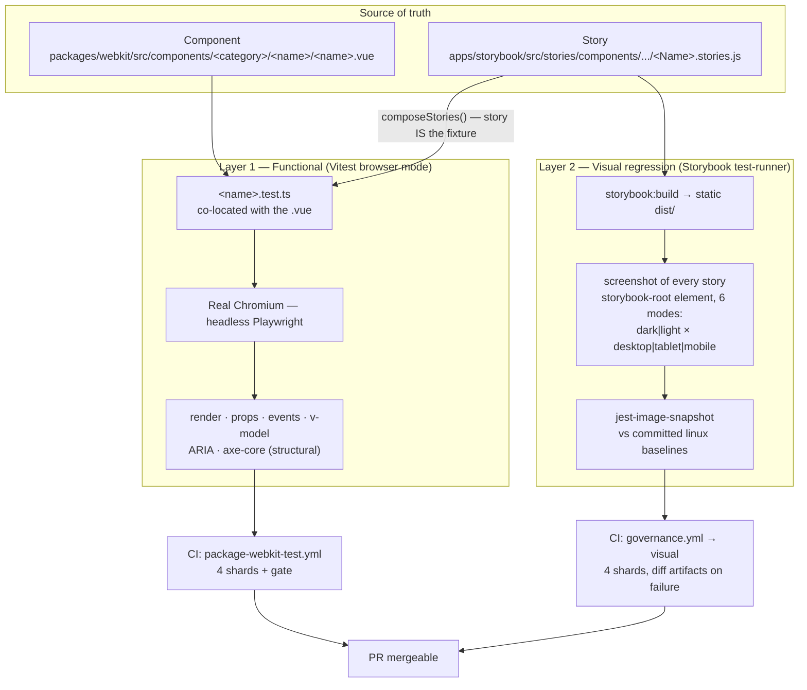
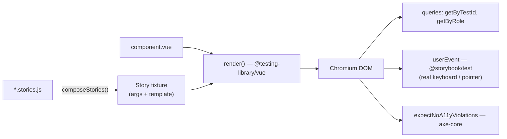
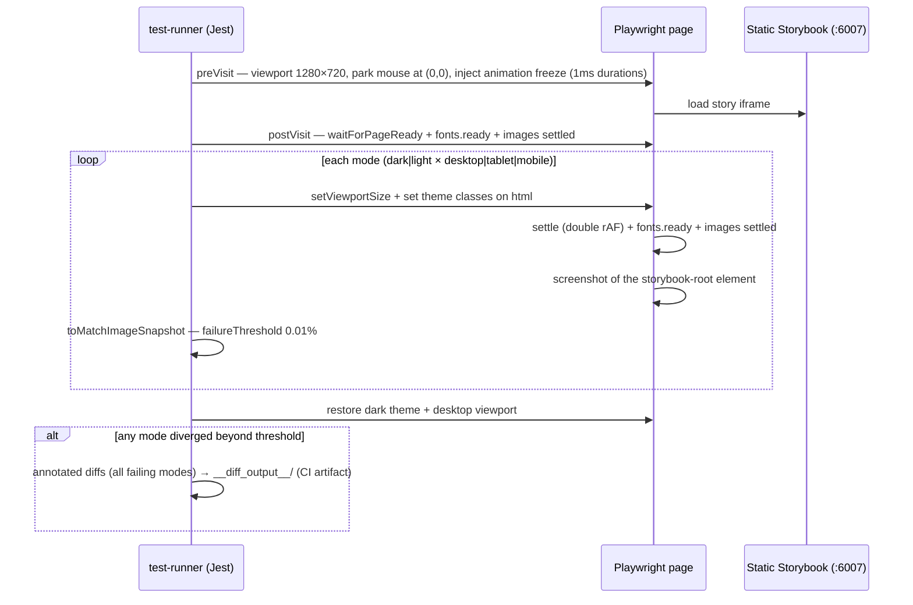
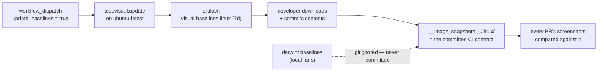
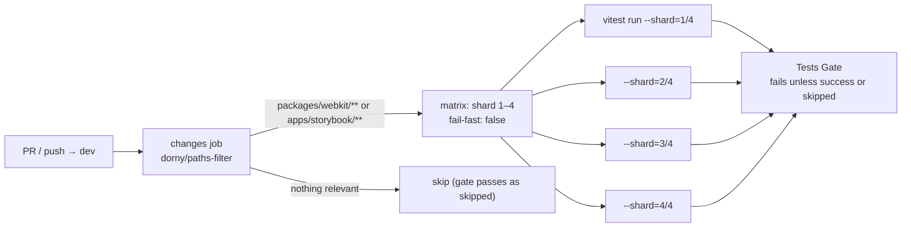

# Test Architecture — Overview

> **@aziontech/webkit monorepo** · snapshot of July 2026
> Companion doc: [`OVERVIEW_LINT.md`](./OVERVIEW_LINT.md) (static-quality layers) · Deep audit: [`TESTING_AUDIT_2026-07-02.md`](./TESTING_AUDIT_2026-07-02.md)

## TL;DR

Webkit ships **two complementary test layers**, both running in **real Chromium** (never jsdom):

| Layer                    | Tooling                                     | DOM                                          | Owns                                                                                           | CI workflow                                                                                 |
| ------------------------ | ------------------------------------------- | -------------------------------------------- | ---------------------------------------------------------------------------------------------- | ------------------------------------------------------------------------------------------- |
| **1. Functional / unit** | Vitest 4 browser mode + Playwright          | Unstyled (tokens load, no Tailwind pipeline) | Behavior, structure, events, v-model, ARIA, structural a11y                                    | `package-webkit-test.yml` (4 shards)                                                        |
| **2. Visual regression** | Storybook test-runner + jest-image-snapshot | Fully styled (theme + Tailwind)              | Pixels, layout, color, typography — in a **6-mode matrix**: dark/light × desktop/tablet/mobile | `governance.yml` → `visual` (4 shards); baselines via `app-storybook-generate-baseline.yml` |

Current numbers: **67 component test suites · 1362 tests passing · 1 skipped · ~97% of in-scope component roots covered** — over a library of ~150 components (roots + sub-components).

The split is deliberate: **units prove it works, visual proves it looks right.** Neither layer pretends to do the other's job.

---

## 1. The big picture



Two ideas hold this together:

1. **The story is the fixture.** Unit tests import the component's Storybook story via `composeStories()` — the same markup that documents the component also exercises it. Docs, canvas, and tests cannot drift apart. (Among 11 benchmarked component libraries, this reuse is effectively unique to webkit.)
2. **One browser, two lenses.** Both layers run Chromium via Playwright. Layer 1 mounts components unstyled and asserts _what the DOM is and does_; Layer 2 renders the fully-styled Storybook and asserts _what the pixels look like_.

---

## 2. Layer 1 — Functional tests (Vitest browser mode)

### 2.1 Why a real browser, never jsdom

jsdom silently no-ops exactly the APIs component behavior depends on. A suite that passes there is a false positive for the things that break in production:

| Capability                              | jsdom        | Real Chromium |
| --------------------------------------- | ------------ | ------------- |
| `focus()` / `document.activeElement`    | no-op        | real          |
| Layout / `getBoundingClientRect`        | zeros        | real          |
| `<Teleport>` content in `document.body` | not surfaced | real          |
| Keyboard navigation / focus trap        | fake         | real          |
| Scroll-lock, overlay dismissal          | fake         | real          |

Consequence: **no mocks for layout, positioning, focus, or `<Teleport>` — ever.** If a test "needs" one of those mocks, the test is wrong.

### 2.2 The stack

| Piece         | File                                | What it does                                                                                                                                                                     |
| ------------- | ----------------------------------- | -------------------------------------------------------------------------------------------------------------------------------------------------------------------------------- |
| Runner config | `packages/webkit/vitest.config.ts`  | Vitest **4.1.9** browser mode: `provider: playwright()` (v4 factory), `headless: true`, single `chromium` instance, `retry: 2` in CI (0 local), includes `src/**/*.test.{ts,js}` |
| Global setup  | `packages/webkit/src/test/setup.ts` | `cleanup()` after each test + **anchor-navigation guard** (prevents `<a href>` clicks from tearing down the test iframe, while `@click` handlers still fire)                     |
| A11y helper   | `packages/webkit/src/test/axe.ts`   | `expectNoA11yViolations(container)` — runs **axe-core 4.10** and asserts zero violations                                                                                         |
| Coverage      | `vitest.config.ts` → `coverage`     | V8 provider, `text` + `lcov`, **reporting-only** (no gate yet); measures `src/components/**`, excludes tests, stories, `.figma.ts`, barrels, presets                             |

### 2.3 Anatomy of a component test



The canonical shape (from `avatar.test.ts` / `tag.test.ts`):

```ts
import { composeStories } from '@storybook/vue3'
import { render } from '@testing-library/vue'
import { describe, expect, it } from 'vitest'

import * as stories from '../../../../../apps/storybook/src/stories/components/.../Avatar.stories'
import { expectNoA11yViolations } from '../../test/axe'
import Avatar from './avatar.vue'

const { Default } = composeStories(stories) // Storybook story = test fixture

it('renders the composed Default story fixture', () => {
  const { getByTestId } = render(Default)
  expect(getByTestId('content-avatar')).toHaveAttribute('role', 'img')
})

it('has no accessibility violations', async () => {
  const { container } = render(Avatar, { props: { label: 'AB' } })
  await expectNoA11yViolations(container)
})
```

Conventions that matter:

- **Co-location** — `<name>.test.ts` sits next to `<name>.vue`. Composition components are tested **through their root** (sub-components don't get their own file unless the root can't reach the behavior).
- **Story imports are relative paths** (never a vite alias) so the reference-validation hook can resolve them.
- Overlay content is queried from `document.body` (it really Teleports there), not from the render container.

### 2.4 The mandatory surface — what every test must cover

Fixed by [`.claude/rules/testing.md`](../.claude/rules/testing.md); this is the **floor**, not the ceiling:

| #   | Surface          | Assertion                                                                   |
| --- | ---------------- | --------------------------------------------------------------------------- |
| 1   | Render           | mounts; `data-testid` fallback present; consumer override wins              |
| 2   | Props / variants | each `kind` / `size` / … maps to its `data-*` attribute                     |
| 3   | Events           | every spec'd event fires with the right payload on real user action         |
| 4   | Suppression      | `disabled` / `loading` / `readonly` → action **not** emitted                |
| 5   | v-model          | drive the input, assert `update:modelValue` with the exact value            |
| 6   | ARIA             | `role`, `aria-expanded`, `aria-busy`, `aria-selected`… as declared          |
| 7   | a11y             | `expectNoA11yViolations` on default render + semantically-distinct variants |
| 8   | Composition      | context-aware sub-component reflects/drives the root's `provide`/`inject`   |
| 9   | Overlay          | open/close, `Escape` closes + returns focus, Teleport to body, scroll-lock  |
| 10  | Recursive        | ≥2-level nesting renders and propagates context                             |

### 2.5 The unstyled-DOM decision (and what axe checks)

The unit environment **does not run the Tailwind pipeline** — components mount with token variables loaded but no utility CSS generated. This is intentional (audit §2.0, "Path B"):

- Unit assertions are about **behavior, structure, and ARIA** — none of them need pixels.
- axe-core therefore runs **structural rules only**. Five visual/layout rules are explicitly disabled because they'd be meaningless without real styling: `color-contrast`, `color-contrast-enhanced`, `target-size`, `link-in-text-block`, `scrollable-region-focusable`.
- Structural axe still has teeth — it caught the suite's real defects (`nested-interactive`, `aria-required-children`, `aria-hidden-focus`).
- **Pixels and contrast belong to Layer 2**, where the full theme renders.

### 2.6 The quality bar — no false positives, no filler

- Assert **only what you read in the source**. Never invent props, events, testids, or ARIA.
- **Forbidden assertions:** Tailwind class strings, pixel positions, animation timing, internal component state. (If a test only passes when the implementation is written one specific way, it's a refactor trap — delete it.)
- A real component defect a test exposes → `it.skip` with a one-line reason and a note in the PR. Never fake a pass.

---

## 3. Layer 2 — Visual regression (Storybook test-runner)

Every story in the built Storybook is visited in Chromium and screenshotted in a **6-mode theme × viewport matrix** — `dark-desktop`, `light-desktop`, `dark-tablet`, `light-tablet`, `dark-mobile`, `light-mobile` — each compared pixel-wise against its committed baseline. The matrix (viewport sizes, theme classes, mode names) lives in one place: [`apps/storybook/.storybook/visual-modes.js`](../apps/storybook/.storybook/visual-modes.js), which also feeds the Storybook viewport toolbar.

### 3.1 How one story gets tested



**Baseline naming:** the `dark-desktop` pass keeps the bare story id (`components-actions-button--default.png`) — so baselines from before the matrix stay valid; every other mode is suffixed (`components-actions-button--default--light-mobile.png`).

Determinism measures baked into `apps/storybook/.storybook/test-runner.js`:

| Measure                                                              | Why                                                                                                                                                                                                                                                                  |
| -------------------------------------------------------------------- | -------------------------------------------------------------------------------------------------------------------------------------------------------------------------------------------------------------------------------------------------------------------- |
| Fixed viewports (375×667 / 768×1024 / 1280×720)                      | consistent canvases aligned to the theme's token breakpoints (mobile below `sm`, tablet exactly at `md`, desktop at `xl`)                                                                                                                                            |
| `page.mouse.move(0, 0)` before each story                            | the worker page is reused — a parked pointer prevents hover state (menus, tooltips) leaking into the next screenshot                                                                                                                                                 |
| Animations forced to **1ms** (not `animation: none`)                 | components that wait for `animationend`/`transitionend` to settle would hang forever with animations removed; 1ms keeps events firing while making motion invisible                                                                                                  |
| Freeze style **mirrors `preview.css`'s canvas-transition selectors** | those rules (`.azion-dark > body` etc.) are `!important` at higher specificity than `*`; without the mirror, a theme flip would animate the canvas for 0.4s mid-screenshot — any new `transition` in `preview.css` must be mirrored (sentinel comment in both files) |
| **Double-rAF settle** after each viewport/theme change               | by the second `requestAnimationFrame` the browser has committed a full style→layout→ResizeObserver→paint frame, and every 1ms transition has fired `transitionend` — event-driven, no sleeps                                                                         |
| `document.fonts.ready` + image-settle await (once + per mode)        | screenshots never race font or image loading — every `img` is loaded **and decoded** (or errored) before capture; `networkidle` alone let a remote avatar photo flake both ways                                                                                      |
| `failureThreshold: 0.01%`                                            | absorbs sub-pixel antialiasing noise; a real change moves far more                                                                                                                                                                                                   |
| Per-mode failures are **collected, not fail-fast**                   | one CI run writes every failing mode's diff to `__diff_output__`, so reviewers see the whole picture                                                                                                                                                                 |
| Dark-desktop state restored after each story                         | the worker page is reused; the next story always starts from the canonical state                                                                                                                                                                                     |
| `parameters: { visual: false }` on a story                           | opts it out of all snapshots (still visited, so render errors are caught)                                                                                                                                                                                            |
| `parameters: { visual: { modes: [...] } }` on a story                | narrows the matrix — e.g. the three foundation token galleries shoot `['dark-desktop', 'light-desktop']` only, because their single-column mobile reflow approaches Chromium's 16384px capture ceiling                                                               |

**Rule for future stories:** the screenshot crops the page composite to `#storybook-root`'s box, so a teleported overlay (`position: fixed` on `body`) appears only where it overlaps that box — and the box is narrower on mobile. A story that renders an _open_ teleported overlay should size its root wrapper (like the drawer stories do) or narrow `visual.modes`. Fixed-width content (sticky-column tables) will show realistically clipped mobile layouts — expected; review once at baseline time, deterministic afterward. Narrowing a story's `modes` later orphans the removed modes' PNGs — delete them in the same PR (the regen flow replaces the directory wholesale).

### 3.2 Baseline lifecycle — platform discipline

Font rasterization differs across OSes, so baselines are **per-platform** and only Linux baselines are the contract:



- `apps/storybook/.storybook/test-visual/__image_snapshots__/linux/` → committed, the CI contract.
- `…/darwin/` → local-only, gitignored. **Never commit darwin baselines.**
- Regeneration happens only through the workflow dispatch (or a Linux container) — never from a Mac.

### 3.3 Scripts

| Script (in `apps/storybook`) | Use                                                                                                                    |
| ---------------------------- | ---------------------------------------------------------------------------------------------------------------------- |
| `test:visual`                | run against a live `storybook dev` on :6006                                                                            |
| `test:visual:static`         | serve built `dist/` on :6007 + test (one-shot local)                                                                   |
| `test:visual:ci`             | same, with `--ci` (fail on missing baseline instead of writing one); honors `VISUAL_SHARD=<i>/<n>` (defaults to `1/1`) |
| `test:visual:update`         | regenerate baselines for the current platform                                                                          |

Root conveniences: `pnpm storybook:test:visual` and `pnpm storybook:test:visual:update` (both build Storybook first).

Any run can be narrowed to a mode subset with the `VISUAL_MODES` env var — e.g. `VISUAL_MODES=dark-desktop pnpm --filter storybook run test:visual:static` for a fast local pass, or `VISUAL_MODES=light-desktop,light-tablet,light-mobile … test:visual:update` to regenerate only the light baselines.

---

## 4. CI pipelines

### 4.1 Functional suite — `.github/workflows/package-webkit-test.yml`



- **4 shards** parallelize the ~150-component suite; `retry: 2` (from `vitest.config.ts`) absorbs the rare browser-launch flake.
- Playwright Chromium only (`playwright install --with-deps chromium`), with the browser binary cached on `pnpm-lock.yaml` (`~/.cache/ms-playwright`).
- The **gate job** (`test-check`) is the single required status — it passes when shards succeed _or_ the path filter skipped them.

### 4.2 Visual suite — `governance.yml` → `visual` job (+ `app-storybook-generate-baseline.yml` for baselines)

- The PR/push check is the `visual` job in the ordered governance pipeline, gated by the `changes.outputs.visual` path filter and every upstream job (lint, types, builds, unit tests).
- **Sharded ×4** like the Vitest job (`strategy.matrix.shard`); each shard runs `test:visual:ci` with `VISUAL_SHARD=<i>/4` — jest splits the story _files_ across shards, and each shard shoots the full 6-mode matrix for its slice.
- Steps per shard: install → cache/install Chromium → `storybook:build` → `test:visual:ci` against the static build.
- On failure: uploads `visual-diff-output-shard-<i>` (annotated diffs for every failing mode, 7-day retention) so reviewers see exactly which pixels moved.
- Baseline regeneration is dispatch-only via `.github/workflows/app-storybook-generate-baseline.yml`: `update_baselines=true` runs `test:visual:update` (unsharded, 60-minute timeout) and uploads `visual-baselines-linux` to download and commit; the optional `modes` input (→ `VISUAL_MODES`) regenerates a subset.

### 4.3 Where the other gates sit

Static quality (ESLint, Stylelint, Prettier, `vue-tsc`, type-coverage, security scans, Storybook build smoke) runs in `governance.yml` — covered in [`OVERVIEW_LINT.md`](./OVERVIEW_LINT.md). One governance job matters here: **publish safety** (§5).

---

## 5. Publish safety — tests never ship to npm

Two mechanisms, verified in CI (`governance.yml` → build job):

1. `packages/webkit/package.json#files` negates test artifacts:
   ```json
   "files": ["src", "!src/**/*.test.{ts,js}", "!src/test/**", "package.json"]
   ```
2. `pack:check` asserts it:
   ```bash
   ! npm pack --dry-run 2>&1 | grep -E '\.test\.(ts|js)|src/test/'
   ```

`packages/webkit/tsconfig.json` also excludes `*.test.ts` and `src/test/` from declaration emit — no `.d.ts` is generated for test code.

---

## 6. Enforcement & scaffolding — how the floor stays enforced

| Mechanism                                                 | Kind                         | What it does                                                                                                                 |
| --------------------------------------------------------- | ---------------------------- | ---------------------------------------------------------------------------------------------------------------------------- |
| [`.claude/rules/testing.md`](../.claude/rules/testing.md) | Rule (source of truth)       | Fixes the browser-mode requirement, the 10-surface floor, and the hard prohibitions                                          |
| `enforce-test-exists.mjs`                                 | Claude Code PostToolUse hook | Warns when a root `.vue` is written without a co-located `<name>.test.ts`                                                    |
| `component-scaffold` skill                                | Generator                    | Every new component is born with a starter test (render + testid override + axe) that the author expands to the full surface |
| `validate-references.mjs`                                 | Claude Code PreToolUse hook  | Blocks test files whose imports don't resolve (e.g. a mistaken `@stories` alias instead of a relative path)                  |
| `package-webkit-test.yml` gate                            | CI                           | No PR merges with a red shard                                                                                                |

---

## 7. Command cheat sheet

| Command (repo root)                 | What it runs                                    |
| ----------------------------------- | ----------------------------------------------- |
| `pnpm webkit:test`                  | full browser-mode suite, headless               |
| `pnpm webkit:test:watch`            | watch mode                                      |
| `pnpm webkit:test:ui`               | Vitest UI with a **headed** browser (debugging) |
| `pnpm webkit:test:coverage`         | suite + V8 coverage report (`text` + `lcov`)    |
| `pnpm storybook:test:visual`        | build Storybook + run visual snapshots locally  |
| `pnpm storybook:test:visual:update` | regenerate local (darwin) baselines             |
| `pnpm --filter webkit pack:check`   | assert no test file leaks into the npm tarball  |

---

## 8. Design decisions — the "why" in one table

| Decision                                                              | Alternative rejected                                           | Rationale                                                                                                                                                                                                                                      |
| --------------------------------------------------------------------- | -------------------------------------------------------------- | ---------------------------------------------------------------------------------------------------------------------------------------------------------------------------------------------------------------------------------------------- |
| Vitest **browser mode** (real Chromium)                               | jsdom                                                          | jsdom no-ops focus/layout/Teleport — false positives on exactly the behaviors that break in production                                                                                                                                         |
| **Story as fixture** (`composeStories`)                               | separate hand-written fixtures                                 | docs, canvas, and tests exercise the same markup; drift becomes impossible                                                                                                                                                                     |
| **Unstyled** unit DOM                                                 | wiring the Tailwind pipeline into Vitest                       | no unit assertion needs pixels; cost (postcss + theme config duplication) buys nothing — pixels are Layer 2's job                                                                                                                              |
| axe **structural-only** in units                                      | full axe rule set                                              | contrast/target-size without real CSS would mislead; structural rules caught every real defect so far                                                                                                                                          |
| **Snapshots at Storybook level**, per-platform baselines              | visual SaaS (Chromatic etc.) / cross-platform baselines        | self-hosted, zero external service; linux-only committed baselines eliminate font-rasterization noise                                                                                                                                          |
| **Full 6-mode matrix per story** (dark/light × desktop/tablet/mobile) | single dark-desktop snapshot; per-story opt-in for extra modes | light tokens have full parity and responsive tokens reshape nearly every story below `md` — default-on coverage catches theme and layout regressions everywhere; stories narrow via `visual.modes` only for technical limits (capture ceiling) |
| **4-shard CI matrix** + retry 2                                       | single job                                                     | ~150-component suite parallelizes; retries absorb browser-launch flakes without hiding real failures                                                                                                                                           |
| Coverage **reporting-only**                                           | coverage gate                                                  | signal first, ratchet later — the functional floor (10 surfaces) is the real gate                                                                                                                                                              |
| Tests co-located, published-excluded                                  | separate `__tests__/` tree                                     | test lives with the component it proves; `files` negation + `pack:check` keep npm clean                                                                                                                                                        |
