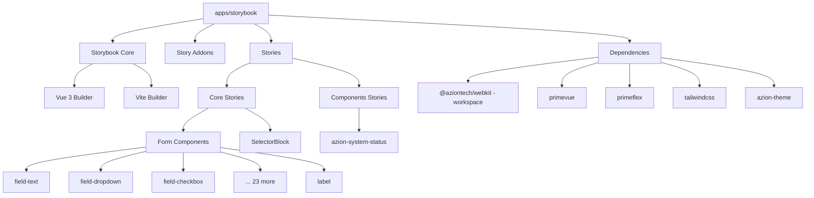

# Storybook Implementation Plan for @aziontech/webkit

## Overview

This plan outlines the implementation of a Storybook application in `apps/storybook` to document and develop the `@aziontech/webkit` component library. The Storybook will use Vue 3, PrimeVue, PrimeFlex, Tailwind CSS, and azion-theme to match the production environment.

## Architecture



## Technology Stack

| Technology | Version | Purpose |
|------------|---------|---------|
| Storybook | 8.x | Component documentation |
| Vue | 3.5.x | Frontend framework |
| Vite | 6.x | Build tool |
| PrimeVue | 3.47.2 | UI component library |
| PrimeFlex | 3.3.1 | CSS utility library |
| Tailwind CSS | 3.4.x | Utility-first CSS |
| azion-theme | 1.18.3 | Custom theming |
| vee-validate | 4.15.x | Form validation |

## Directory Structure

```
apps/storybook/
├── .storybook/
│   ├── main.js              # Main Storybook configuration
│   ├── preview.js           # Global decorators and parameters
│   ├── preview-head.html    # Custom head elements
│   └── theme.js             # Storybook theme customization
├── src/
│   ├── stories/
│   │   ├── core/
│   │   │   ├── form/
│   │   │   │   ├── FieldText.stories.js
│   │   │   │   ├── FieldDropdown.stories.js
│   │   │   │   ├── FieldCheckboxBlock.stories.js
│   │   │   │   ├── FieldDropdownIcon.stories.js
│   │   │   │   ├── FieldDropdownLazyLoader.stories.js
│   │   │   │   ├── FieldDropdownLazyLoaderDynamic.stories.js
│   │   │   │   ├── FieldDropdownLazyLoaderWithFilter.stories.js
│   │   │   │   ├── FieldDropdownMultiSelectLazyLoader.stories.js
│   │   │   │   ├── FieldGroupCheckbox.stories.js
│   │   │   │   ├── FieldGroupRadio.stories.js
│   │   │   │   ├── FieldGroupSwitch.stories.js
│   │   │   │   ├── FieldInputGroup.stories.js
│   │   │   │   ├── FieldMultiSelect.stories.js
│   │   │   │   ├── FieldNumber.stories.js
│   │   │   │   ├── FieldPhoneNumber.stories.js
│   │   │   │   ├── FieldPhoneNumberCountry.stories.js
│   │   │   │   ├── FieldPickList.stories.js
│   │   │   │   ├── FieldRadioBlock.stories.js
│   │   │   │   ├── FieldSwitch.stories.js
│   │   │   │   ├── FieldSwitchBlock.stories.js
│   │   │   │   ├── FieldTextArea.stories.js
│   │   │   │   ├── FieldTextIcon.stories.js
│   │   │   │   ├── FieldTextPassword.stories.js
│   │   │   │   ├── FieldTextPrivacy.stories.js
│   │   │   │   └── Label.stories.js
│   │   │   └── SelectorBlock.stories.js
│   │   └── components/
│   │       └── AzionSystemStatus.stories.js
│   └── styles/
│       └── preview.css       # Global styles for Storybook
├── package.json
├── vite.config.js
├── tailwind.config.js
├── postcss.config.js
└── README.md
```

## Implementation Steps

### Step 1: Create apps/storybook/package.json

The package.json will use workspace references for `@aziontech/webkit`:

```json
{
  "name": "@aziontech/webkit/storybook",
  "version": "0.1.0",
  "private": true,
  "scripts": {
    "dev": "storybook dev -p 6006",
    "build": "storybook build",
    "build:static": "storybook build -o dist",
    "preview": "storybook preview"
  },
  "dependencies": {
    "@aziontech/webkit": "workspace:*",
    "vue": "^3.5.29",
    "primevue": "3.47.2",
    "primeflex": "^3.3.1",
    "vee-validate": "^4.15.1"
  },
  "devDependencies": {
    "@storybook/vue3": "^8.6.0",
    "@storybook/vue3-vite": "^8.6.0",
    "@storybook/addon-essentials": "^8.6.0",
    "@storybook/addon-docs": "^8.6.0",
    "@storybook/addon-controls": "^8.6.0",
    "@storybook/addon-actions": "^8.6.0",
    "@storybook/addon-viewport": "^8.6.0",
    "@storybook/addon-toolbars": "^8.6.0",
    "@storybook/addon-measure": "^8.6.0",
    "@storybook/addon-outline": "^8.6.0",
    "@vitejs/plugin-vue": "^5.2.4",
    "vite": "^6.4.1",
    "tailwindcss": "^3.4.19",
    "autoprefixer": "^10.4.27",
    "postcss": "^8.5.8",
    "azion-theme": "^1.18.3"
  }
}
```

### Step 2: Storybook Main Configuration

`.storybook/main.js`:

```javascript
export default {
  stories: ['../src/**/*.mdx', '../src/**/*.stories.@(js|jsx|mjs|ts|tsx)'],
  addons: [
    '@storybook/addon-links',
    '@storybook/addon-essentials',
    '@storybook/addon-docs',
    '@storybook/addon-controls',
    '@storybook/addon-actions',
    '@storybook/addon-viewport',
    '@storybook/addon-toolbars',
    '@storybook/addon-measure',
    '@storybook/addon-outline'
  ],
  framework: {
    name: '@storybook/vue3-vite',
    options: {}
  },
  docs: {
    autodocs: 'tag'
  },
  core: {
    builder: '@storybook/builder-vite'
  },
  viteFinal: async (config) => {
    // Merge custom Vite config
    return config;
  }
};
```

### Step 3: Storybook Preview Configuration

`.storybook/preview.js`:

```javascript
import { setup } from '@storybook/vue3';
import PrimeVue from 'primevue/config';
import ToastService from 'primevue/toastservice';
import ConfirmationService from 'primevue/confirmationservice';
import 'primeflex/primeflex.css';
import 'azion-theme/dist/css/azion-theme.min.css';
import 'primevue/resources/primevue.min.css';
import '../src/styles/preview.css';

// Import Tailwind
import './tailwind.css';

// Setup Vue app with PrimeVue
setup((app) => {
  app.use(PrimeVue, { ripple: true });
  app.use(ToastService);
  app.use(ConfirmationService);
});

// Export parameters
export const parameters = {
  actions: { argTypesRegex: '^on[A-Z].*' },
  controls: {
    matchers: {
      color: /(background|color)$/i,
      date: /Date$/i
    }
  },
  docs: {
    source: {
      type: 'code'
    }
  },
  options: {
    storySort: {
      order: ['Introduction', 'Form Components', 'Core Components', 'UI Components']
    }
  }
};
```

### Step 4: Tailwind Configuration

`tailwind.config.js`:

```javascript
/** @type {import('tailwindcss').Config} */
export default {
  content: [
    './src/**/*.{js,ts,vue}',
    '../node_modules/@aziontech/webkit/src/**/*.vue'
  ],
  theme: {
    extend: {}
  },
  plugins: [],
  prefix: 'tw-'
};
```

### Step 5: Example Story - FieldText

`src/stories/form/FieldText.stories.js`:

```javascript
import FieldText from '@aziontech/webkit/field-text';

export default {
  title: 'Form Components/FieldText',
  component: FieldText,
  tags: ['autodocs'],
  argTypes: {
    name: { control: 'text', description: 'Field name for form submission' },
    label: { control: 'text', description: 'Label text' },
    placeholder: { control: 'text', description: 'Placeholder text' },
    description: { control: 'text', description: 'Helper text below input' },
    disabled: { control: 'boolean' },
    readonly: { control: 'boolean' },
    sensitive: { control: 'boolean', description: 'Mark as sensitive data' },
    aditionalError: { control: 'text', description: 'Additional error message' },
    value: { control: 'text' }
  }
};

export const Default = {
  args: {
    name: 'field-text',
    label: 'Text Field',
    placeholder: 'Enter text...',
    description: 'Helper text goes here'
  }
};

export const Disabled = {
  args: {
    name: 'field-text-disabled',
    label: 'Disabled Field',
    placeholder: 'Cannot edit',
    disabled: true
  }
};

export const WithError = {
  args: {
    name: 'field-text-error',
    label: 'Field with Error',
    placeholder: 'Enter text...',
    aditionalError: 'This field has an error'
  }
};

export const Sensitive = {
  args: {
    name: 'field-text-sensitive',
    label: 'Sensitive Field',
    placeholder: 'Enter sensitive data...',
    sensitive: true
  }
};
```

### Step 6: Add Scripts to Root package.json

Add the following scripts to the root `package.json`:

```json
{
  "scripts": {
    "storybook:dev": "pnpm --filter storybook run dev",
    "storybook:build": "pnpm --filter storybook run build",
    "storybook:preview": "pnpm --filter storybook run preview"
  }
}
```

## Components to Document

### Form Components (23)

| Component | Export Path | Description |
|-----------|-------------|-------------|
| field-auto-complete | `@aziontech/webkit/field-auto-complete` | Autocomplete input field |
| field-checkbox-block | `@aziontech/webkit/field-checkbox-block` | Checkbox with label block |
| field-dropdown | `@aziontech/webkit/field-dropdown` | Dropdown select |
| field-dropdown-icon | `@aziontech/webkit/field-dropdown-icon` | Dropdown with icon |
| field-dropdown-lazy-loader | `@aziontech/webkit/field-dropdown-lazy-loader` | Lazy-loading dropdown |
| field-dropdown-lazy-loader-dynamic | `@aziontech/webkit/field-dropdown-lazy-loader-dynamic` | Dynamic lazy dropdown |
| field-dropdown-lazy-loader-with-filter | `@aziontech/webkit/field-dropdown-lazy-loader-with-filter` | Lazy dropdown with filter |
| field-dropdown-multi-select-lazy-loader | `@aziontech/webkit/field-dropdown-multi-select-lazy-loader` | Multi-select lazy dropdown |
| field-group-checkbox | `@aziontech/webkit/field-group-checkbox` | Checkbox group |
| field-group-radio | `@aziontech/webkit/field-group-radio` | Radio button group |
| field-group-switch | `@aziontech/webkit/field-group-switch` | Switch group |
| field-input-group | `@aziontech/webkit/field-input-group` | Input group |
| field-multi-select | `@aziontech/webkit/field-multi-select` | Multi-select dropdown |
| field-number | `@aziontech/webkit/field-number` | Number input |
| field-phone-number | `@aziontech/webkit/field-phone-number` | Phone number input |
| field-phone-number-country | `@aziontech/webkit/field-phone-number-country` | Phone with country |
| field-pick-list | `@aziontech/webkit/field-pick-list` | Pick list component |
| field-radio-block | `@aziontech/webkit/field-radio-block` | Radio with label block |
| field-switch | `@aziontech/webkit/field-switch` | Switch toggle |
| field-switch-block | `@aziontech/webkit/field-switch-block` | Switch with label block |
| field-text | `@aziontech/webkit/field-text` | Text input |
| field-text-area | `@aziontech/webkit/field-text-area` | Textarea input |
| field-text-icon | `@aziontech/webkit/field-text-icon` | Text input with icon |
| field-text-password | `@aziontech/webkit/field-text-password` | Password input |
| field-text-privacy | `@aziontech/webkit/field-text-privacy` | Privacy text field |
| label | `@aziontech/webkit/label` | Label component |

### Core Components (1)

| Component | Export Path | Description |
|-----------|-------------|-------------|
| selector-block | `@aziontech/webkit/selector-block` | Selector block component |

### UI Components (1)

| Component | Export Path | Description |
|-----------|-------------|-------------|
| azion-system-status | `@aziontech/webkit/azion-system-status` | System status button |

## Best Practices for Stories

1. **Naming Convention**: Use PascalCase for story file names matching the component
2. **Story Variants**: Include at least:
   - Default state
   - Disabled state
   - Error state
   - Loading state (if applicable)
3. **Controls**: Expose all props as controls for interactive documentation
4. **Actions**: Use action logging for event handlers
5. **Documentation**: Add JSDoc-style comments for prop descriptions

## Testing the Implementation

After implementation, run:

```bash
# Install dependencies
pnpm install

# Start Storybook development server
pnpm storybook:dev

# Build static Storybook
pnpm storybook:build
```

## Success Criteria

- [ ] Storybook starts without errors
- [ ] All 26 components have story files
- [ ] PrimeVue components render correctly
- [ ] Tailwind CSS utilities work
- [ ] azion-theme styles apply correctly
- [ ] Controls allow interactive prop manipulation
- [ ] Documentation tab shows for each component
- [ ] Stories are organized by category
- [ ] Dark/light theme toggle works (if configured)

## Timeline and Effort

This plan focuses on breaking down the implementation into clear, actionable steps. The work should proceed sequentially through each step, ensuring each configuration file and story is created correctly before moving to the next.

## Next Steps

1. Switch to Code mode to implement the files
2. Create the directory structure
3. Add configuration files
4. Create stories for all components
5. Test and validate the implementation
