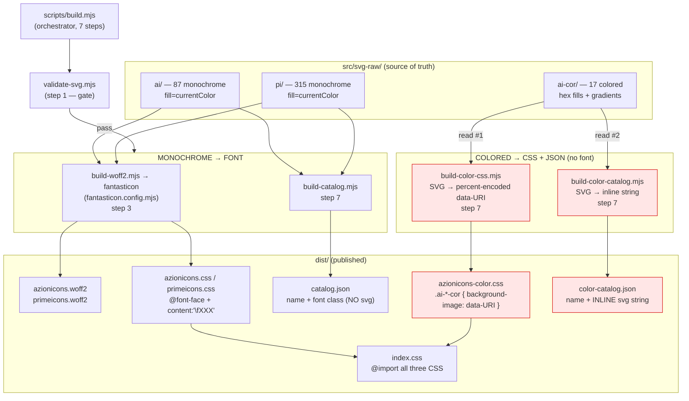

# `@aziontech/icons` — build flow & the colored-icon implementation

> How SVG sources become the shipped `dist/`, why colored icons take a different path
> from monochrome ones, and precise answers to the three doubts:
> **(1) is there duplicated compilation? (2) how is the SVG used? (3) font-family or base64?**

---

## TL;DR — the three answers

| Question | Answer |
|---|---|
| **Is it duplicated compilation?** | The two colored steps aren't *redundant* (they serve different consumption modes), **but the colored SVG payload is duplicated across two `dist` files** — `azionicons-color.css` (~32 KB) and `color-catalog.json` (~32 KB) both embed the same 17 SVGs. Each script also re-reads `ai-cor/` from disk independently. The **monochrome** catalog embeds *no* SVG (names only), so this duplication is unique to the colored path. |
| **How is the SVG used in the icon?** | Two delivery modes. **(a) CSS class** — the SVG becomes a `background-image` data-URI on `.ai-<name>-cor`, sized to `1em`, used as `<i class="ai-google-cor"></i>`. **(b) Inline SVG string** — `color-catalog.json` stores the raw `<svg>` markup, which a consumer injects into the DOM (e.g. `ColoredIcon.vue` via a render function + `innerHTML`). |
| **Compiled to `font-family` or base64?** | **Neither, for colored.** Colored icons are **percent-encoded (URL-encoded) UTF-8 SVG data-URIs** (`data:image/svg+xml,%3Csvg…`) — *not* base64 — plus raw inline SVG in the catalog. **`font-family` is the *monochrome* path only** (woff2 glyphs via `@font-face` + `content: '\fXXX'`). |

---

## Why two pipelines exist

A woff2 **font glyph is single-color** — it's painted with the surrounding `color`/`currentColor`. That's perfect for UI icons (`fill="currentColor"`) but impossible for a brand logo that carries its **own** palette (Angular's two reds + white, Astro's pink→purple gradient, etc.).

So the package splits by *colorability*:

| | Monochrome (`ai`, `pi`) | Colored (`ai-cor`) |
|---|---|---|
| Source | `src/svg-raw/ai/` (87), `src/svg-raw/pi/` (315) | `src/svg-raw/ai-cor/` (17) |
| SVG fill | `fill="currentColor"` (recolorable) | `fill="#DA0B36"`, gradients, `fill="white"` (fixed palette) |
| Compiler | **fantasticon** → woff2 font | custom scripts → CSS data-URI + JSON |
| Delivery | `@font-face` glyph | `background-image` data-URI **+** inline SVG |
| CSS mechanism | `.ai.ai-x::before { content: '\f101' }` | `.ai-x-cor { background-image: url("data:image/svg+xml,…") }` |
| Recolorable? | ✅ via `color` | ❌ keeps its own palette |
| Catalog | `catalog.json` (name + class, **no SVG**) | `color-catalog.json` (name + **inline SVG**) |

---

## The build flow

`npm run build` → `node scripts/build.mjs`, a 7-step orchestrator:



> 🔴 The red nodes are the colored path. Note `ai-cor/` fans out into **two** independent
> readers (`read #1`, `read #2`), each serializing the same SVGs into a different `dist` file —
> this is the "duplication" the questions ask about.

### Step-by-step (`build.mjs`)

1. **Validate** — `validate-svg.mjs` gates the build; failure aborts.
2. **Clean** — wipe & recreate `dist/`.
3. **Fonts** — `build-woff2.mjs` runs **fantasticon** for `ai` and `pi` (per `fantasticon.config.mjs`): emits `azionicons.woff2` + `azionicons.css`, `primeicons.woff2` + `primeicons.css` from the `templates/css.hbs` Handlebars template. **Colored icons are not touched here.**
4. **Barrel** — write `index.css` = `@import` of `azionicons.css` + **`azionicons-color.css`** + `primeicons.css`.
5. **`dist/package.json`** — publishable manifest with the `exports` map (`.`, `./azionicons`, `./azionicons-color`, `./primeicons`, `./catalog`, `./color-catalog`).
6. **Copy** `LICENSE` + `README.md`.
7. **Catalogs + colored CSS** — runs three scripts in sequence:
   - `build-catalog.mjs` → `catalog.json` (mono `ai` + `pi`; **name + class only, no SVG bytes**)
   - `build-color-catalog.mjs` → `color-catalog.json` (colored; **inline SVG strings**)
   - `build-color-css.mjs` → `azionicons-color.css` (colored; **data-URI `background-image`**)

---

## Question 1 — is there duplicated compilation?

**Two things are duplicated, one thing is not.**

**✅ Duplicated: the colored SVG *payload* (in `dist`).** The same 17 vectors are serialized into **both**:

- `dist/azionicons-color.css` — as percent-encoded `background-image` data-URIs (**~31.9 KB**)
- `dist/color-catalog.json` — as raw inline `<svg>` strings (**~32.3 KB**)

A consumer that pulls **both** (the icons-gallery does — CSS for the `<i>` grid, catalog for search/preview) ships the colored vector data **twice**. It gzips well and each mode is usually used alone, so the practical cost is small — but the bytes are genuinely duplicated.

**✅ Duplicated: the source *read* (at build time).** `build-color-css.mjs` and `build-color-catalog.mjs` each do their own `readdirSync('ai-cor').filter('.svg').sort()` + per-file `readFileSync`. The directory is walked twice. Because both filter+sort identically, **the two outputs cannot drift** — they're always the same icon set. Cost is negligible (17 files).

**❌ Not duplicated / not redundant: the *purpose*.** The two outputs are not interchangeable:

| | `azionicons-color.css` (data-URI) | `color-catalog.json` (inline) |
|---|---|---|
| Drop-in as a font-like `<i>` class | ✅ | ❌ |
| Recolor / inspect nodes in DOM | ❌ (it's a background image) | ✅ (real `<svg>` elements) |
| Programmatic list / search / gallery | ❌ | ✅ |

So: the **compilation steps are justified** (two real consumption modes), but the **colored SVG bytes are duplicated across two artifacts** — and unlike the mono path, whose `catalog.json` stores only names (glyph outlines live solely in the woff2), the colored path has no single source of truth in `dist`.

> **If dedup ever matters:** make one artifact the source and derive the other — e.g. generate `azionicons-color.css` *from* `color-catalog.json` (or drop the CSS and have consumers render only from the catalog). Today it's a deliberate trade: two ergonomic entry points at the cost of ~32 KB of overlap.

---

## Question 2 — how is the SVG used in the icon?

### Mode A — CSS `background-image` (`azionicons-color.css`)

`build-color-css.mjs` emits **one shared rule** (the box) + **one rule per icon** (the image):

```css
/* shared box — every colored icon */
.ai-angular-cor, .ai-astro-cor, /* … */ .ai-vue-cor {
  display: inline-block;
  width: 1em;   /* scales with font-size, like a glyph's box */
  height: 1em;
  background-repeat: no-repeat;
  background-position: center;
  background-size: contain;
  vertical-align: -0.125em;
}

/* per icon — the vector */
.ai-google-cor {
  background-image: url("data:image/svg+xml,%3Csvg width='14' … %3E%3C/svg%3E");
}
```

Usage — identical ergonomics to a font icon:

```html
<i class="ai-google-cor"></i>                 <!-- self-contained: sizes to 1em -->
<i class="ai-google-cor" style="font-size:32px"></i>   <!-- scales via font-size -->
```

> The class name already contains the `ai-` prefix (filename `ai-google-cor.svg` → `.ai-google-cor`), and the rule is fully self-contained. Unlike monochrome — which needs **both** `.ai` (sets `font-family`) **and** `.ai-x` (sets the glyph) — colored needs **only** the single `.ai-*-cor` class. Adding a bare `ai` (as the CSS header comment shows) is harmless but unnecessary.

### Mode B — inline SVG string (`color-catalog.json`)

```json
{ "icon": "ai-angular-cor", "name": "ai-angular-cor", "colored": true,
  "svg": "<svg width=\"14\" … <path fill=\"#DA0B36\" …/></svg>" }
```

The consumer injects the markup as **real DOM `<svg>`**. Example — the gallery's `ColoredIcon.vue`:

```js
render() {
  return h('span', {
    class: 'inline-flex [&>svg]:w-full [&>svg]:h-full',
    style: { width: `${this.size}px`, height: `${this.size}px` },
    innerHTML: this.svg          // build-time package asset, never user input
  })
}
```

This keeps gradients, `clipPath`, and multiple fills as inspectable nodes — which a `background-image` cannot expose.

### (For contrast) Monochrome — font glyph

`ai`/`pi` SVGs are baked into `azionicons.woff2` by fantasticon; the CSS maps class → codepoint:

```css
@font-face { font-family: 'azionicons'; src: url('azionicons.woff2') format('woff2'); }
.ai { font-family: 'azionicons'; /* … */ }
.ai.ai-angular::before { content: '\f10a'; }
```

```html
<i class="ai ai-angular" style="color: var(--primary)"></i>   <!-- recolorable -->
```

---

## Question 3 — `font-family` or base64?

**Colored icons are neither a font nor base64.**

- **Encoding is percent-encoding (URL-encoded UTF-8), not base64.** `svgToDataUri()` in `build-color-css.mjs` follows the *mini-svg-data-uri* approach: collapse whitespace, convert `"` → `'`, then escape only the characters that break `url()` — `% # { } < >`:

  ```js
  return `data:image/svg+xml,${encoded}`   // NOT ;base64,
  ```

  Verified in `dist`: the string is `data:image/svg+xml,%3Csvg …` and **`grep base64` returns 0 matches**.

- **Why not base64?** Base64 inflates payload ~33 % and is opaque. Percent-encoded SVG stays smaller, remains human-readable in the CSS, and compresses better under gzip/brotli.

- **`font-family` is exclusively the monochrome path** — `azionicons` / `primeicons` woff2 via `@font-face`. Colored icons never enter the font.

| Icon kind | Mechanism | Encoding |
|---|---|---|
| Monochrome (`ai`, `pi`) | woff2 `@font-face` + `content: '\fXXX'` | binary glyph in woff2 |
| Colored — CSS (`.ai-*-cor`) | `background-image` data-URI | **percent-encoded UTF-8** (not base64) |
| Colored — catalog | inline `<svg>` string | **none** (raw markup in JSON) |

---

## Published surface (`dist/` → `package.json#exports`)

| Export | File | Contains |
|---|---|---|
| `.` | `index.css` | `@import` barrel of all three CSS files |
| `./azionicons` | `azionicons.css` | mono font-face + glyph classes |
| `./azionicons-color` | `azionicons-color.css` | colored `background-image` data-URIs |
| `./primeicons` | `primeicons.css` | mono font-face + glyph classes |
| `./catalog` | `catalog.json` | mono list (name + class, no SVG) |
| `./color-catalog` | `color-catalog.json` | colored list (name + inline SVG) |

**Consumers**: `apps/icons-gallery` (`ColoredIcon.vue`, `App.vue`) and `apps/storybook` (`ColoredIconPreview.vue`, `IconGrid.vue`, `Icons.stories.js`) read the catalogs; any app importing `@aziontech/icons/azionicons-color` gets the `<i class="ai-*-cor">` classes.

---

## Summary

- **One source of truth** (`src/svg-raw/`), **two pipelines** split by colorability.
- **Monochrome → font** (`fantasticon`, woff2, `font-family`, recolorable, `content:'\fXXX'`).
- **Colored → CSS data-URI + inline JSON** (no font; **percent-encoded**, not base64).
- **Duplication is real but narrow**: the colored SVG payload lives in *both* `azionicons-color.css` and `color-catalog.json` (~32 KB each), and each build script re-reads `ai-cor/` independently. The steps aren't redundant (distinct consumption modes) — the *bytes* overlap. The monochrome catalog avoids this by storing names only.
