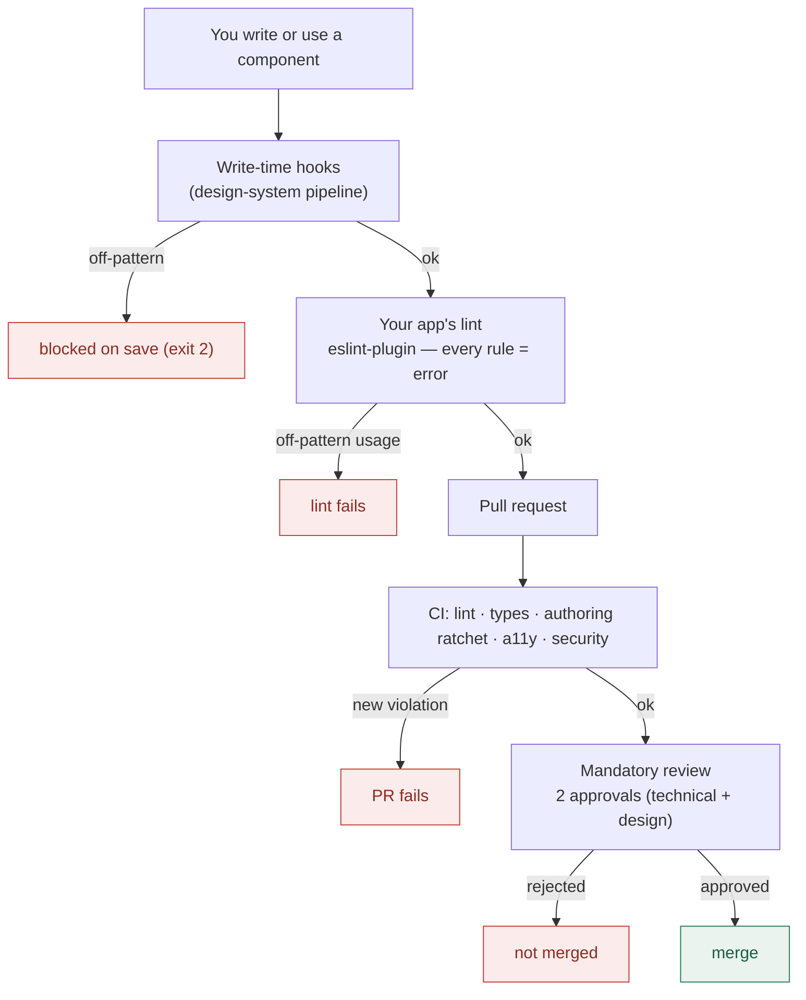

# Guidelines — building and using `@aziontech/webkit`

> This is the one-page digest. The **complete styleguide** — every code standard in full
> detail, with the gate that blocks each one — is [`STYLEGUIDE.md`](./STYLEGUIDE.md).

One page to **see every pattern** you need, whether you are:

- **A — building a component by hand** (in the design system or in your own project) → follow
  the **general construction patterns** below; or
- **B — using a webkit component in your project** → follow the **consumer rules** below.

Everything here is **enforced** — automatically (lint / CI) or by mandatory review — so the
pattern is the path of least resistance, not a checklist you have to remember. The machine-
readable source of these standards (and their `scope`) is
[`.claude/hooks/_lib/standards.mjs`](../../../.claude/hooks/_lib/standards.mjs); each rule
lives in [`.claude/rules/`](../../../.claude/rules/).

> **General vs. webkit.** The patterns in **Part A** are `scope: general` — they ship to your
> project and apply to any Vue component. The rules that are `scope: webkit` (spec-first
> pipeline, the exports map, Storybook "Show code", releases) live only inside the design
> system and are **not** on this page.

New to the design system? Start with the [Getting started](../README.md#getting-started)
(install, theme CSS, first component, playground) — this page is the pattern reference you
come back to.

---

## Foundations — the tokens everything is built from

Every visual decision comes from a token. Raw values (hex, Tailwind palette names, raw
typography) are **blocked** by lint and hooks — the token is always the answer.

| Foundation     | Use                                                                                                                                         | Never                                                     |
| -------------- | ------------------------------------------------------------------------------------------------------------------------------------------- | --------------------------------------------------------- |
| **Color**      | `var(--primary)` · `var(--bg-surface)` · `var(--text-default)` · `var(--border-default)` · feedback `--success/--warning/--danger/--info`   | `#f3652b` · `text-blue-600` · `rgb(…)`                    |
| **Typography** | the generated classes — `text-heading-md`, `text-body-sm`, `text-button-lg`, `text-label-md` (font + size + line-height + tracking bundled) | `text-sm` · `leading-*` · `tracking-*` · `font-family`    |
| **Spacing**    | the semantic scale — `p-[var(--spacing-md)]` · `gap-[var(--spacing-sm)]` (`xxs…xxl`)                                                        | primitive `--spacing-1…-96` · `p-4` when a token applies  |
| **Shape**      | `rounded-[var(--shape-button)]` · `--shape-card` · `--shape-elements`                                                                       | `rounded-lg` · numeric radii                              |
| **Shadow**     | `shadow-[var(--shadow-md)]`                                                                                                                 | bare `shadow-md` · hex/rgb elevation                      |
| **Motion**     | catalogued `animate-*` utilities + `transition-*` with token durations; **every** motion class pairs with `motion-reduce:`                  | local `@keyframes` · `duration-[…]` · animation libraries |

Tokens are light/dark aware — using them is what makes a component theme correctly for free.
The full catalog lives in the theme package (`@aziontech/theme`) and renders in the
Storybook **Foundations** section.

---

## Part A — building a component by hand (general patterns)

Each is a `scope: general` standard. Follow ✅, avoid ❌.

| Pattern                 | ❌ Avoid                                                             | ✅ Do                                                                                   |
| ----------------------- | -------------------------------------------------------------------- | --------------------------------------------------------------------------------------- |
| **Two-way value**       | `defineProps({ modelValue }) + emit('update:modelValue')`            | `const model = defineModel<string>()`                                                   |
| **Props**               | `defineProps({ kind: { type: String } })` · `variant` · `isDisabled` | `withDefaults(defineProps<Props>(), {…})` · `kind` · `disabled`                         |
| **Prop vocabulary**     | `sm/md/lg` · `variant` · `closeable`                                 | `small/medium/large` · `kind` · `dismissible`                                           |
| **Emits**               | `defineEmits(['click'])` · `emit('click', item)`                     | `defineEmits<{ 'item-click':[e,item] }>()` — event first                                |
| **Slots**               | `<slot/>` with no declaration                                        | `defineSlots<{ default():unknown }>()`                                                  |
| **Composables**         | `return reactive({…})`                                               | `return { value: readonly(v), set }` · args via `toValue` · cleanup in `onScopeDispose` |
| **Styling**             | `const kindClasses = {…}` · `#f3652b` · `text-blue-600`              | `data-[kind=primary]:bg-[var(--primary)]` inline · tokens only                          |
| **Component structure** | random `<script setup>` order                                        | fixed order: options → props → emits → models → slots → state                           |
| **Root element**        | wrapper `<div>` that swallows attrs · `as` prop                      | own the root · `inheritAttrs:false` + `$attrs` + `cn` · polymorphism via `href`         |
| **States**              | ad-hoc spinner / "no results" string                                 | `data-*` + `Skeleton` / `EmptyState`                                                    |
| **Accessibility**       | `<div @click>`                                                       | `<button>` + `focus-visible` + `motion-reduce:` + `useId`                               |
| **data-testid**         | (none)                                                               | `:data-testid="testId"` → `<category>-<name>`                                           |
| **Deprecation**         | remove/rename silently                                               | `@deprecated` (name the replacement + version) → one major → remove                     |

Each links to its full rule in [`.claude/rules/`](../../../.claude/rules/) (e.g. `v-model.md`,
`props.md`, `composables.md`) — the index is [`rules/README.md`](../../../.claude/rules/README.md).

### Folder structure — one component, one folder

A component named `<name>` lives in one predictable folder; two components differ only in
what they do, never in how their files are arranged:

```
<category>/<name>/
├── <name>.vue              # the root component (kebab file = canonical name)
├── index.ts                # compound API (composition only): Object.assign(Root, { Part })
├── injection-key.ts        # typed InjectionKey (composition only)
├── composables/            # composables specific to THIS component
│   └── use-<name>-context.ts
└── <name>-<part>/          # each public sub-component in its own folder
    └── <name>-<part>.vue
```

- **Co-locate** what only this component uses; promote to a shared `composables/` folder
  only when a second component needs it.
- **One component per `.vue` file**; the kebab file name is the canonical name everywhere
  (PascalCase in `defineOptions`, `<category>-<name>` in the testid).
- The **`<script setup>` order is fixed** too: imports → `defineOptions` → types → props →
  emits → models → slots → inject/composables → state → computed → watchers → functions →
  `defineExpose`.

---

## Part B — using a webkit component in your project

Install the ESLint plugin and enable the `recommended` preset — **every rule is `error`**, so
off-pattern usage fails your lint.

```js
// eslint.config.js
import webkit from '@aziontech/webkit/eslint-plugin'
export default [...webkit.configs.recommended]
```

| Do this                   | ❌ Avoid                                                | ✅ Do                                                    |
| ------------------------- | ------------------------------------------------------- | -------------------------------------------------------- |
| **Import**                | `import { Button } from '@aziontech/webkit'`            | `import Button from '@aziontech/webkit/button'`          |
| **No internal / typo**    | `@aziontech/webkit/src/…` · `…/buton`                   | `@aziontech/webkit/button`                               |
| **Tree-shaking**          | `import Table` (compound) when you only render the root | `import TableRoot from '@aziontech/webkit/table-root'`   |
| **Don't override styles** | `<Button class="p-8" />`                                | compose inside its slots, or use a `styleSeam` component |
| **No deprecated**         | importing a deprecated component                        | the suggested replacement                                |
| **Tokens, not colors**    | `class="text-[#fff]"`                                   | `class="text-[var(--text-default)]"`                     |
| **Icons**                 | `import Icons from '@aziontech/icons'`                  | `import '@aziontech/icons'` (side-effect)                |

**Discover the API before you write it:** the webkit MCP server (`npx webkit-mcp`, wired
into `.mcp.json` by `init`) answers
`list_components`, `get_component`, `list_tokens`, `suggest_component`, `get_best_practices`,
and `validate_usage` — so an AI (or you) gets the right import / token / prop _before_ the lint
has to reject the wrong one.

---

## How the standards are enforced

The lint blocks the wrong thing; the MCP + this guideline show the right thing. Nothing is a
suggestion — every pattern blocks the merge, automatically or by mandatory review.



**What happens at each step**

1. **Write-time** — as the component is written (by the AI pipeline or an editor with the
   hooks), a wrong pattern is blocked on save (`exit 2`): manual `v-model`, runtime
   `defineProps`, `<slot>` without `defineSlots`, off-token styling, phantom imports.
2. **Your app's lint** — the `@aziontech/webkit` ESLint plugin (all rules `error`) blocks
   wrong _usage_: barrel imports, deep imports, style overrides, deprecated components.
3. **CI** — the authoring **ratchet** re-runs the write-time checks over the changed source and
   fails the PR on any new violation; `lint` / `types` / `a11y` / `security` run alongside.
4. **Mandatory review** — the parts a regex cannot verify (behavioural a11y, `defineExpose`
   minimality, state-matrix completeness) are gated by the 2 required approvals; the PR cannot
   merge without them.

The result: the standard is applied by construction, checked independently, and blocked when
violated — so a component reaches review already on-pattern, and a consumer stays on-pattern
in their own build.
