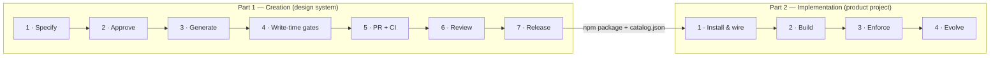

# The Webkit Process — from idea to production usage

This document is the **map of the whole system**, in two parts:

- **[Part 1 — Creation](#part-1--creation)**: how a component is born _inside_ the design
  system — spec-first, generated by a pipeline, gated at write time, in CI, and in review.
- **[Part 2 — Implementation](#part-2--implementation)**: how a product team _adopts and
  uses_ webkit — one `init`, then guided (MCP + docs) and enforced (lint + CI) usage.

Both parts run on the same **rule system**: 25 standards, each one a rule document paired
with a blocking gate. Rules are scoped **`general`** (they apply to any Vue codebase and
ship to consumer projects) or **`webkit`** (internal to authoring the design system). The
[roadmap](#roadmap--the-standards-pack) is to extract the `general` set into a standalone
**standards pack** — our governance system for patterns and best practices, consumable by
any project even without webkit.

**How to read this doc:** every stage starts with a 2–3 line summary. Click
**▸ Details** to unfold the full mechanics — the exact rules, gates, files, and failure
modes of that stage. Read only the summaries for the 5-minute version.



---

## Part 1 — Creation

A component is never written directly. It goes **spec → approval → generation → gates →
CI → review → release**, and every step is either automated or blocking. The pipeline
exists so the standard is applied _by construction_, not remembered by discipline.

| #   | Stage            | Trigger                       | Output                                  | Blocks when                                       |
| --- | ---------------- | ----------------------------- | --------------------------------------- | ------------------------------------------------- |
| 1   | Specify          | `/spec-create <name>`         | `.specs/<name>.md` (`status: draft`)    | —                                                 |
| 2   | Approve          | `spec-validate`               | `status: approved` + body checksum      | schema/Constraints invalid                        |
| 3   | Generate         | `/component-create <name>`    | `.vue` + exports + story + Code Connect | spec missing/tampered, any phase fails            |
| 4   | Write-time gates | every `Write`/`Edit`          | approved or `exit 2`                    | off-token, off-spec, phantom import, broken story |
| 5   | PR + CI          | `/create-branch` + `/open-pr` | PR to `dev`                             | any governance job fails                          |
| 6   | Review           | PR                            | 2 approvals (technical + design)        | review-only surfaces off-pattern                  |
| 7   | Release          | merge to `main`               | semantic-release per package            | commit type ⇄ bump divergence                     |

### Stage 1 — Specify

`/spec-create <name>` interviews the author and writes `.specs/<name>.md` with
`status: draft`. The spec is the **contract**: everything the component will have — and
nothing more — is declared here first.

<details>
<summary><b>▸ Details — what a spec contains and the status lifecycle</b></summary>

**The spec file** follows [`.specs/_template.md`](../../../.specs/_template.md) and is
validated against [`.specs/_schema.json`](../../../.specs/_schema.json). It declares:

- **Frontmatter** — `name` (kebab, the canonical name on all six surfaces), `category`,
  `structure` (`monolithic` | `composition`, decided by the `structure-decide` skill),
  `status`, `checksum`, optional `figma.url`.
- **Purpose / Usage** — prose + a runnable usage block (compound dot-notation leads for
  composition components).
- **Props / Events / Slots / Sub-components tables** — the complete public API. Names must
  come from the [prop-vocabulary](../../../.claude/rules/prop-vocabulary.md) dictionary
  (`kind`, not `variant`; `dismissible` for light-dismiss; `(event, item?)` payloads per
  [event-payloads](../../../.claude/rules/event-payloads.md)).
- **Tokens & Motion tables** — every visual decision mapped to a DESIGN.md token or a
  catalogued `animate-*` utility (each motion class paired with `motion-reduce:`).
- **Constraints block** — verbatim from the template; altering it fails validation.

**Status lifecycle**

```
draft ──spec-validate──▶ approved ──/component-create──▶ implemented ──(freeze)──▶ locked
```

- `draft` — editable; cannot drive code generation.
- `approved` — validated; `checksum = sha256(body)` written. Code may be generated.
- `implemented` — the component exists; re-runs allowed for follow-up edits.
- `locked` — changes require an explicit `spec_version` bump.

**Figma is an input, not an authority** — per
[migration](../../../.claude/rules/migration.md), Figma variables/regions/states are
_rewritten_ into our conventions (names, tokens, states); a Figma value with no token match
is recorded as a theme gap, never inlined as a hex.

</details>

### Stage 2 — Approve

The `spec-validator` sub-agent re-checks schema, body sections, and the Constraints block.
On pass it computes the body checksum and flips `status: draft → approved`. Nothing is
written to `src/` before this.

<details>
<summary><b>▸ Details — what validation checks and why the checksum exists</b></summary>

- **Schema** — frontmatter fields, category enum, kebab name.
- **Body rules** — required sections present (Purpose, Usage, Props, Events, Slots,
  Tokens, Motion, Stories, Sub-components when `structure: composition`).
- **Constraints block** — must carry the canonical bullets verbatim
  ([`_lib/spec.mjs`](../../../.claude/hooks/_lib/spec.mjs) →
  `constraintsBlockHasCanonicalBullets`); this is the anti-drift seal against inherited
  or hand-edited specs.
- **Checksum** — `sha256(body)` stored in frontmatter. Every later stage (the
  `enforce-spec-exists` hook, `/component-create` preflight) recomputes and compares:
  a spec edited after approval is **tamper-blocked** until re-validated.

The validator never approves an already-`approved`/`implemented`/`locked` spec — it only
moves `draft → approved`.

</details>

### Stage 3 — Generate

`/component-create <name>` is a fixed orchestration: isolated sub-agents each get the spec
plus a narrow rule set, and produce the `.vue`(s), the `package.json#exports` entries, the
Storybook story, and the Code Connect mapping. The orchestrator never writes code itself.

<details>
<summary><b>▸ Details — the 10-step pipeline and its sub-agents</b></summary>

| Step | Phase                | Agent / skill                                       | Writes?                        | Fails the run when                                       |
| ---- | -------------------- | --------------------------------------------------- | ------------------------------ | -------------------------------------------------------- |
| 0    | Preflight            | orchestrator                                        | log only                       | spec absent, `draft`, `locked`, or checksum mismatch     |
| 1    | Spec validation      | `spec-validator`                                    | no                             | any schema/body/Constraints failure                      |
| 2    | Discovery (parallel) | `figma-extractor` → `token-mapper`, `reuse-auditor` | no                             | — (emit JSON artifacts)                                  |
| 3    | Reconciliation       | orchestrator                                        | no                             | spec tokens/regions don't reconcile with discovery       |
| 4    | Scaffold             | `scaffolder` + `component-scaffold` skill           | `.vue`(s), `index.ts`, exports | any hook blocks (surfaced, never worked around)          |
| 5    | Storybook            | `storybook-writer` + `storybook-write` skill        | `.stories.js`                  | story-source gate blocks                                 |
| 6    | Code Connect         | `code-connect-writer`                               | `.figma.ts` (or skip)          | — (skip becomes a pending item)                          |
| 7    | Echo cross-check     | `echo-reporter`                                     | no                             | independent re-parse diverges from the spec              |
| 8    | Validation           | `validate-component`                                | no                             | lint / type-check / type-coverage / storybook build fail |
| 9    | Finalize             | orchestrator                                        | spec status → `implemented`    | —                                                        |

Key properties:

- **Isolation** — each sub-agent sees the spec + its rules, never the conversation or
  another agent's raw output. A missing datum surfaces as `BLOCKED: <reason>`, never as an
  invention ([no-invention](../../../.claude/rules/no-invention.md)).
- **Composition components** get the compound API by construction: `index.ts` with
  `Object.assign(Root, { Part })`, the flat compound export, and the tree-shakeable
  `<name>-root` export ([compound-api](../../../.claude/rules/compound-api.md)).
- **Double-entry bookkeeping** — Step 7 re-derives the public API from the written files
  with an independent parser and diffs it against the spec; hook and echo disagreeing is
  itself a failure state (`degraded`).

</details>

### Stage 4 — Write-time gates

Seven hooks run on every file operation (whoever the author is — pipeline, human with
hooks, or another agent). A wrong pattern is blocked **on save** with `exit 2` and a
message naming the violated rule.

<details>
<summary><b>▸ Details — every hook and what it blocks</b></summary>

Wired in [`.claude/settings.json`](../../../.claude/settings.json); all fail **open** on
unexpected errors (a hook bug never bricks the workflow) and fail **closed** on violations.

| Hook                                                                              | Fires on                                  | Blocks                                                                                                                                                                                                                           |
| --------------------------------------------------------------------------------- | ----------------------------------------- | -------------------------------------------------------------------------------------------------------------------------------------------------------------------------------------------------------------------------------- |
| [`enforce-component-create`](../../../.claude/hooks/enforce-component-create.mjs) | first `Write` of a new component `.vue`   | creating a webkit component outside the `/spec-create` → `/component-create` pipeline                                                                                                                                            |
| [`enforce-spec-exists`](../../../.claude/hooks/enforce-spec-exists.mjs)           | `Write` of a component `.vue`             | spec missing, not `approved`/`implemented`, or checksum-tampered (legacy whitelist exempt)                                                                                                                                       |
| [`validate-tokens`](../../../.claude/hooks/validate-tokens.mjs)                   | `Write\|Edit\|MultiEdit`                  | hex/RGB/HSL, Tailwind palette, raw typography, `class` in `defineProps`, `any`, `@ts-ignore` — engine: [`token-checks.js`](../src/eslint-plugin/token-checks.js)                                                                 |
| [`validate-references`](../../../.claude/hooks/validate-references.mjs)           | `Write\|Edit\|MultiEdit`                  | phantom `@aziontech/webkit/*` subpaths, unresolved relative imports, uninstalled npm packages, forbidden positioning/animation libs                                                                                              |
| [`validate-authoring`](../../../.claude/hooks/validate-authoring.mjs)             | `Write\|Edit\|MultiEdit`                  | construction anti-patterns — manual `v-model`, runtime `defineProps`, undeclared slots, un-`readonly` composable state, silent breaking changes — engine: [`authoring-checks.js`](../src/eslint-plugin/authoring-checks.js)      |
| [`validate-story-source`](../../../.claude/hooks/validate-story-source.mjs)       | `Write\|Edit\|MultiEdit` of `*.stories.*` | a Docs "Show code" that isn't a runnable PascalCase SFC (13 checks, **strict** — no grandfathering); also runs standalone via `--all` — engine: [`story-source-checks.mjs`](../../../.claude/hooks/_lib/story-source-checks.mjs) |
| [`validate-spec-compliance`](../../../.claude/hooks/validate-spec-compliance.mjs) | **Post**ToolUse on component `.vue`       | any divergence from the spec: missing/extra prop/event/slot/sub-component, name/testid drift, uncatalogued animations, missing `motion-reduce:`                                                                                  |

**One engine, many surfaces.** The hooks do not own their logic — they call shared
engines (`authoring-checks`, `token-checks`, `story-source-checks`, `spec-compliance-checks`)
that the CI ratchet re-runs repo-wide and the consumer ESLint plugin ships. The same
check can therefore never disagree with itself across surfaces; the pairing is asserted in
CI by the [invariant test](#the-invariant).

</details>

### Stage 5 — Pull request + CI

Branches and PRs go through `/create-branch` and `/open-pr` (base `dev`, Conventional
Commits, no attribution footers). CI is the **Governance Pipeline** — the same engines the
hooks ran, re-run over the whole repo, so an editor push that never ran a hook cannot merge
an off-pattern change either.

<details>
<summary><b>▸ Details — the governance jobs and the ratchet</b></summary>

[`.github/workflows/governance.yml`](../../../.github/workflows/governance.yml) — jobs
gated by a `changes` path filter and summarized by a required `governance-check` gate:

| Job                | Runs                                                                                | Fails the PR when                                                                            |
| ------------------ | ----------------------------------------------------------------------------------- | -------------------------------------------------------------------------------------------- |
| `security`         | `pnpm audit` + depcheck                                                             | high-severity advisory or ghost dependency                                                   |
| `lint`             | eslint (`--max-warnings 0`) + stylelint + prettier `--check` over `packages/webkit` | any warning or format drift                                                                  |
| `types`            | `vue-tsc --noEmit` + `type-coverage --at-least 95`                                  | type error or coverage below 95%                                                             |
| `build`            | `pnpm pack:dry` + size-limit                                                        | package doesn't pack or exceeds its [bundle budget](../../../.claude/rules/bundle-budget.md) |
| `storybook`        | full `storybook:build`                                                              | any story fails to compile                                                                   |
| `toolkit`          | `catalog:check` + `test:toolkit` + `authoring`                                      | catalog drift, toolkit test failure, or a **new** authoring violation                        |
| `governance-check` | summary gate                                                                        | any upstream job failed (skips count as pass)                                                |

**The ratchet** ([`check-authoring.mjs`](../scripts/check-authoring.mjs)) re-runs the
construction, token, spec-compliance, and story-source engines over every source file and
compares against [`authoring-baseline.json`](../scripts/authoring-baseline.json):

- Existing debt is **frozen** (multiset semantics — a second occurrence of a baselined
  violation still blocks); new code must comply.
- Fixing debt shrinks the baseline — prune deliberately with `pnpm authoring:update`.
- Story-source debt is currently **zero** (the whole stories tree is on the canonical
  pattern); the remaining entries are legacy construction/token/spec debt.

<a id="the-invariant"></a>**The invariant** —
[`test/standards/invariant.test.mjs`](../test/standards/invariant.test.mjs) asserts in CI:

1. every `.claude/rules/*.md` has a registry entry in
   [`standards.mjs`](../../../.claude/hooks/_lib/standards.mjs) and vice versa;
2. every standard has at least one **blocking** surface (nothing advisory);
3. every declared enforcer resolves to a real hook / eslint rule / known CI gate;
4. hook, CI ratchet, and consumer lint import the **same** engine modules;
5. every shipped eslint rule is claimed by a standard (no orphan gates).

This is the mechanical guarantee that "what we tell the AI" and "what blocks the merge"
are the same definition — they cannot drift without failing CI.

</details>

### Stage 6 — Review

Two approvals (technical + design) are mandatory. Review covers only what a machine
cannot: behavioural accessibility, `defineExpose` minimality, state-matrix completeness,
event-payload shape, and design intent. Everything mechanical arrived already verified.

<details>
<summary><b>▸ Details — the review-only surfaces</b></summary>

Standards whose registry entry includes `surface: 'review'` delegate a _part_ of their
enforcement to humans (the rest is automated):

- [accessibility](../../../.claude/rules/accessibility.md) — axe rules run in Storybook,
  but keyboard flows and semantics are judged by a person.
- [event-payloads](../../../.claude/rules/event-payloads.md) — the emit _set_ is pinned to
  the spec automatically; the `(event, item?)` shape is confirmed in review.
- [component-states](../../../.claude/rules/component-states.md),
  [root-element](../../../.claude/rules/root-element.md),
  [component-structure](../../../.claude/rules/component-structure.md) — script-order and
  polymorphism nuances.
- [compound-api](../../../.claude/rules/compound-api.md),
  [migration](../../../.claude/rules/migration.md),
  [bundle-budget](../../../.claude/rules/bundle-budget.md) — anatomy naming, nothing
  inherited as-is, budget exceptions.

Branch protection makes the approvals required; the PR cannot merge without them.

</details>

### Stage 7 — Release

Merging to `main` runs semantic-release per package (`webkit`, `theme`, `icons`). The
Conventional Commit type decides the bump, and the type set is kept identical across
commitlint, every `.releaserc`, CONTRIBUTING, and the PR flows.

<details>
<summary><b>▸ Details — type → bump mapping and the four synchronized sources</b></summary>

Per [release-types](../../../.claude/rules/release-types.md):

| Type                                                                | Bump                    |
| ------------------------------------------------------------------- | ----------------------- |
| `feat`                                                              | minor                   |
| `fix` / `hotfix` / `chore` / `docs` / `style` / `refactor` / `perf` | patch                   |
| `test` / `ci` / `revert`                                            | none (`release: false`) |
| `!` or `BREAKING CHANGE:`                                           | major                   |

The four places that carry this mapping —
[`commitlint.config.js`](../../../commitlint.config.js), every
`packages/*/.releaserc`, [`CONTRIBUTING.md`](../../../CONTRIBUTING.md), and the
`/open-pr` + `/create-branch` flows — must be edited **in the same PR** when a type is
added or re-mapped. The analyzer only counts a commit toward a package when it touches
files under that package.

At publish time `.releaserc`'s `prepareCmd` generates `.d.ts` files (`vue-tsc`); the
repo itself ships source (`exports` points at `./src/...`) — `.d.ts` is never committed.
The published package embeds [`catalog.json`](../catalog.json) — the version-locked
manifest Part 2 runs on.

</details>

---

## Part 2 — Implementation

A product team adopts webkit with **one command** and lives inside two layers: **GUIDE**
(the MCP server + docs help you and your AI write correct usage up front) and **FORCE**
(ESLint + Stylelint + pre-commit + CI block what's wrong). Both read the same
`catalog.json`, so they always agree with the installed webkit version.

| #   | Stage          | What happens                              | Layer        |
| --- | -------------- | ----------------------------------------- | ------------ |
| 1   | Install & wire | `npx @aziontech/webkit init`              | sets up both |
| 2   | Build          | components composed with guided discovery | GUIDE        |
| 3   | Enforce        | lint on save / commit / CI + `doctor`     | FORCE        |
| 4   | Evolve         | upgrades, deprecations, catalog re-lock   | both         |

### Stage 1 — Install & wire

`npx @aziontech/webkit init` reads the project first, computes a plan, and applies it
without clobbering anything: dependencies, ESLint + Stylelint presets, the MCP server,
husky pre-commit, and a `.claude/` guidance bundle. Idempotent; `--dry-run` previews.

<details>
<summary><b>▸ Details — everything init writes and the flags</b></summary>

1. **Dependencies** recorded in `package.json` (webkit, theme, icons + dev tooling) — the
   install itself stays yours.
2. **`eslint.config.mjs`** wiring `@aziontech/webkit/eslint-plugin` (or a merge snippet if
   a config exists).
3. **`.stylelintrc.json`** extending `@aziontech/webkit/stylelint-config` with `.vue`/`.scss`
   syntaxes wired.
4. **`.mcp.json`** — the `webkit` MCP server merged in.
5. **husky `pre-commit`** — lint on commit.
6. **`.claude/` bundle** — the `general`-scope rules rewritten for consumers
   (`webkit-tokens`, `webkit-props`, `webkit-emits`, `webkit-styling`,
   `webkit-prefer-over-custom`, …), a `webkit-usage` skill, and reviewer/expert/adopter
   agents ([`cli-templates/claude/`](../cli-templates/claude/)).
7. **`CLAUDE.md` fragment** — appended once behind a marker.
8. **Theme wiring advice** — suggests the theme import at your entry file, never edits it.

Flags: `--dry-run` (plan only) · `--strict` (default preset — everything `error`) ·
`--recommended` (correctness `error`, performance `warn`). Unknown flags are rejected.

</details>

### Stage 2 — Build

Compose real elements, import flat subpaths, style with tokens. Before writing usage, ask
the MCP — it answers from the installed catalog, so the import path, props, and tokens are
right _before_ the linter would have to reject them.

<details>
<summary><b>▸ Details — the consumer rules and the MCP surface</b></summary>

**Usage rules** (the FORCE layer blocks each ❌):

| Concern      | ❌                                           | ✅                                              |
| ------------ | -------------------------------------------- | ----------------------------------------------- |
| Import       | `import { Button } from '@aziontech/webkit'` | `import Button from '@aziontech/webkit/button'` |
| Internals    | `@aziontech/webkit/src/…`                    | published subpaths only                         |
| Tree-shaking | compound `…/table` for root-only use         | `…/table-root`                                  |
| Styling      | `class="p-8 text-[#fff]"` on a component     | compose slots; tokens via `var(--*)`            |
| Icons        | importing the whole set                      | per-icon subpaths / side-effect import          |
| Deprecated   | keep using it                                | the `@deprecated`-named replacement             |

**MCP tools** (the `webkit-mcp` bin of `@aziontech/webkit`, registered in `.mcp.json` by
`init`): `list_components`,
`list_categories`, `list_tokens`, `get_component`, `get_import`, `search_components`,
`suggest_component`, `get_usage_example`, `validate_usage` — every answer derived from the
installed [`catalog.json`](../catalog.json), never from training data.

**Building your own components?** The `general` construction standards apply to any Vue
code and ship in the `init` bundle — the one-page digest is
[`GUIDELINES.md`](./GUIDELINES.md) Part A, the full detail is
[`STYLEGUIDE.md`](./STYLEGUIDE.md).

</details>

### Stage 3 — Enforce

The ESLint plugin (all catalog-backed rules), the Stylelint config, and the husky hook
block off-pattern usage at commit; the same lint runs in the project's CI.
`npx @aziontech/webkit doctor` health-checks the whole wiring.

<details>
<summary><b>▸ Details — rules, presets, autofix, and doctor</b></summary>

**ESLint rules** ([`src/eslint-plugin/`](../src/eslint-plugin/)):
`valid-import-path` (with typo suggestions), `no-deep-internal-import`,
`no-barrel-import`, `no-whole-icon-set-import`, `no-hardcoded-color`,
`prefer-tree-shakeable-root`, plus the shipped construction standards
(`authoring-standards`) and `prefer-webkit-component` (adoption steering). Deterministic
import rules are **autofixable**. Presets: `strict` (default), `recommended`,
`performance` — in every preset the correctness rules are `error`, never `warn`.

**Stylelint** (`@aziontech/webkit/stylelint-config`): `color-no-hex`, color functions,
named colors — CSS/SCSS/`<style>` counterpart of `no-hardcoded-color`.

**Fail-open by design**: without a resolvable catalog the catalog-backed rules disable
themselves with a one-line warning (they never crash an unrelated repo). That's what
`doctor` exists for — it reports catalog resolution, config presence, MCP registration,
husky wiring, theme import, and resolved dependency versions as `OK`/`WARN`/`FAIL`, exits
non-zero on `FAIL`, and is safe to run as a CI setup gate.

</details>

### Stage 4 — Evolve

Upgrades are ordinary npm bumps: the catalog inside the package re-locks lint + MCP to the
new version automatically. Breaking changes arrive as majors with `@deprecated` bridges one
major ahead; `doctor` reports the resolved versions to pin.

<details>
<summary><b>▸ Details — deprecation policy and staying current</b></summary>

- Per [deprecation](../../../.claude/rules/deprecation.md): a renamed/removed API ships one
  major with a `@deprecated` JSDoc naming the replacement and the removal version; the
  consumer lint flags usage of deprecated members, so migration happens before the removal
  major lands.
- `init` records toolkit deps as `latest` for a fresh setup and never re-pins what you
  pinned; after installing, `doctor` prints the resolved versions with suggested `^x.y.z`
  pins.
- Both published channels resolve identically (`@aziontech/webkit` release,
  `@aziontech/webkit.dev` dev) — the lint import-prefix and MCP answers follow whichever
  is installed.

</details>

---

## The rule system — scopes and enforcement

A **standard** is one `.claude/rules/<id>.md` (the human rule, written for the AI and for
people) **plus** a registry entry in
[`standards.mjs`](../../../.claude/hooks/_lib/standards.mjs) naming its blocking gates.
Nothing is advisory: every standard blocks the merge automatically or by mandatory review,
and the [invariant test](#the-invariant) fails CI if a rule and its gate ever drift apart.

**Enforcement surfaces**

| Surface      | Meaning                                       | Executor                                                                |
| ------------ | --------------------------------------------- | ----------------------------------------------------------------------- |
| `write-time` | blocks the file operation (`exit 2`)          | `.claude/hooks/*.mjs`                                                   |
| `lint`       | `error` in the shipped ESLint plugin          | `src/eslint-plugin/rules/*`                                             |
| `ci`         | fails the PR                                  | governance jobs / ratchet / commitlint / size-limit / branch protection |
| `review`     | cannot merge without the 2 required approvals | humans                                                                  |

### `scope: general` — 14 standards (ship to consumer projects)

Construction patterns for **any** Vue component, anywhere. These are the future
[standards pack](#roadmap--the-standards-pack).

| Standard                                                             | One line                                                                                   |
| -------------------------------------------------------------------- | ------------------------------------------------------------------------------------------ |
| [prop-vocabulary](../../../.claude/rules/prop-vocabulary.md)         | one canonical name/type/default per concept (`kind`, `small/medium/large`, `dismissible`…) |
| [props](../../../.claude/rules/props.md)                             | typed `interface Props` + `withDefaults` + JSDoc; no negative/prefixed booleans            |
| [v-model](../../../.claude/rules/v-model.md)                         | two-way state via `defineModel`, never manual prop+emit                                    |
| [emits](../../../.claude/rules/emits.md)                             | typed `defineEmits`; no echo events duplicating `update:*`                                 |
| [event-payloads](../../../.claude/rules/event-payloads.md)           | activation events emit `(event, item?)` — DOM event always first                           |
| [slots](../../../.claude/rules/slots.md)                             | typed `defineSlots`; fallback content lives in the slot                                    |
| [composables](../../../.claude/rules/composables.md)                 | `readonly` state out, `toValue` args in, cleanup in `onScopeDispose`                       |
| [styling](../../../.claude/rules/styling.md)                         | utilities inline on the root; variants via `data-*`; no class-map presets, no `<style>`    |
| [component-structure](../../../.claude/rules/component-structure.md) | one folder per component; fixed `<script setup>` order                                     |
| [root-element](../../../.claude/rules/root-element.md)               | own the root; `inheritAttrs:false` + `$attrs` + `cn`; polymorphism via `href`              |
| [component-states](../../../.claude/rules/component-states.md)       | loading/empty/error rendered via `data-*` + DS components                                  |
| [accessibility](../../../.claude/rules/accessibility.md)             | semantics, keyboard, `focus-visible`, `motion-reduce`, `useId`                             |
| [testid](../../../.claude/rules/testid.md)                           | overridable `data-testid` derived `<category>-<name>`                                      |
| [deprecation](../../../.claude/rules/deprecation.md)                 | `@deprecated` naming the replacement → one major → removal                                 |

### `scope: webkit` — 11 standards (internal to the design system)

How **this repo** authors, documents, and releases; they never ship to consumers.

| Standard                                                       | One line                                                                           |
| -------------------------------------------------------------- | ---------------------------------------------------------------------------------- |
| [no-invention](../../../.claude/rules/no-invention.md)         | the spec is a sealed contract; anything missing → `BLOCKED`, not invented          |
| [naming](../../../.claude/rules/naming.md)                     | one kebab name across spec, folder, export, `defineOptions`, testid, story binding |
| [imports](../../../.claude/rules/imports.md)                   | flat public export (`@aziontech/webkit/<name>`); category only in the folder       |
| [compound-api](../../../.claude/rules/compound-api.md)         | composition = compound `index.ts` + tree-shakeable `-root` export                  |
| [dependencies](../../../.claude/rules/dependencies.md)         | CSS-only positioning/animation; granted exceptions listed in the rule              |
| [migration](../../../.claude/rules/migration.md)               | external artifacts are rewritten to our conventions, never inherited               |
| [storybook-source](../../../.claude/rules/storybook-source.md) | "Show code" is an explicit, runnable, PascalCase SFC via `toSfc`                   |
| [release-types](../../../.claude/rules/release-types.md)       | commit type ⇄ version bump identical across 4 sources                              |
| [git-workflow](../../../.claude/rules/git-workflow.md)         | branches/PRs only via `/create-branch` + `/open-pr`, base `dev`                    |
| [bundle-budget](../../../.claude/rules/bundle-budget.md)       | size-limit per entry; tree-shaking preserved                                       |
| [testing](../../../.claude/rules/testing.md)                   | one `<name>.test.ts` per component — Vitest browser mode, story fixture, axe       |

---

## Roadmap — the standards pack

The `general`/`webkit` split exists **on purpose**: the 14 `general` standards are not
webkit-specific — they describe how to build a good Vue component anywhere. The plan is to
extract them into a standalone package: our **governance system for patterns and best
practices**, adoptable by any project (with or without webkit components).

<details>
<summary><b>▸ Details — what moves, what stays, and the staged migration</b></summary>

**What moves into the pack** (everything already exists; the work is repackaging):

| Asset                      | Today                                                | In the pack                               |
| -------------------------- | ---------------------------------------------------- | ----------------------------------------- |
| The 14 `general` rule docs | `.claude/rules/*.md`                                 | the pack's `rules/` (source of truth)     |
| Construction engine        | `src/eslint-plugin/authoring-checks.js`              | pack engine                               |
| Token discipline engine    | `src/eslint-plugin/token-checks.js`                  | pack engine (token source configurable)   |
| ESLint preset              | `@aziontech/webkit/eslint-plugin` (standards subset) | the pack's eslint plugin                  |
| Stylelint config           | `@aziontech/webkit/stylelint-config`                 | the pack's stylelint config               |
| AI guidance bundle         | `cli-templates/claude/`                              | the pack's `init` bundle                  |
| Registry + invariant       | `standards.mjs` + `invariant.test.mjs`               | the pack's registry; webkit re-imports it |

**What stays in webkit**: the 11 `webkit`-scope standards, the spec pipeline
(`.specs/`, `/spec-create`, `/component-create`), the catalog-backed usage rules
(`valid-import-path`, `prefer-tree-shakeable-root`, …), the MCP server, and `catalog.json`
— these are about _this_ design system, not about construction in general.

**Staged migration**

1. **Now (done)** — every standard carries `scope` in the registry; the invariant enforces
   the classification; consumers already receive the general set via the `init` bundle.
2. **Extract** — move the general rule docs + the two engines + the eslint/stylelint
   presets into the pack; webkit becomes the pack's first consumer (its hooks and ratchet
   import the pack's engines instead of local copies).
3. **Generalize** — make the token source and vocabulary configurable (webkit provides its
   dictionary; another project can provide its own without forking the engines).
4. **Adopt** — product repos run the pack's `init` even where webkit isn't used; the
   webkit `init` composes the pack + the webkit-specific layers.

**Definition of done** for the extraction: the invariant test runs _in the pack_ (rule ⇄
gate pairing is the pack's own guarantee), webkit's CI stays green importing the pack, and
a non-webkit repo can adopt the pack with one command.

</details>

---

## Map of artifacts

| Concern                          | Where                                                                                                                                                                             |
| -------------------------------- | --------------------------------------------------------------------------------------------------------------------------------------------------------------------------------- |
| Rule documents (25)              | [`.claude/rules/`](../../../.claude/rules/) — index in its [README](../../../.claude/rules/README.md)                                                                             |
| Machine registry (scope + gates) | [`.claude/hooks/_lib/standards.mjs`](../../../.claude/hooks/_lib/standards.mjs)                                                                                                   |
| Write-time hooks                 | [`.claude/hooks/`](../../../.claude/hooks/) — [README](../../../.claude/hooks/README.md)                                                                                          |
| Shared check engines             | [`src/eslint-plugin/*.js`](../src/eslint-plugin/) + [`.claude/hooks/_lib/*.mjs`](../../../.claude/hooks/_lib/)                                                                    |
| Specs                            | [`.specs/`](../../../.specs/) — template, schema, one `.md` per component                                                                                                         |
| Pipeline commands & skills       | [`.claude/commands/`](../../../.claude/commands/) + [`.claude/skills/`](../../../.claude/skills/)                                                                                 |
| CI                               | [`.github/workflows/governance.yml`](../../../.github/workflows/governance.yml) + [`scripts/check-authoring.mjs`](../scripts/check-authoring.mjs)                                 |
| Invariant test                   | [`test/standards/invariant.test.mjs`](../test/standards/invariant.test.mjs)                                                                                                       |
| Consumer toolkit                 | [`src/cli/`](../src/cli/) · [`src/mcp/`](../src/mcp/) · [`src/eslint-plugin/`](../src/eslint-plugin/) · [`catalog.json`](../catalog.json) — docs in [`docs/toolkit/`](./toolkit/) |
| Consumer pattern digest          | [`GUIDELINES.md`](./GUIDELINES.md) (one page) → [`STYLEGUIDE.md`](./STYLEGUIDE.md) (full detail)                                                                                  |
| Every lint in the stack          | [`DOC_LINTS.md`](./DOC_LINTS.md) — wrong ❌ vs correct ✅ per check                                                                                                               |
